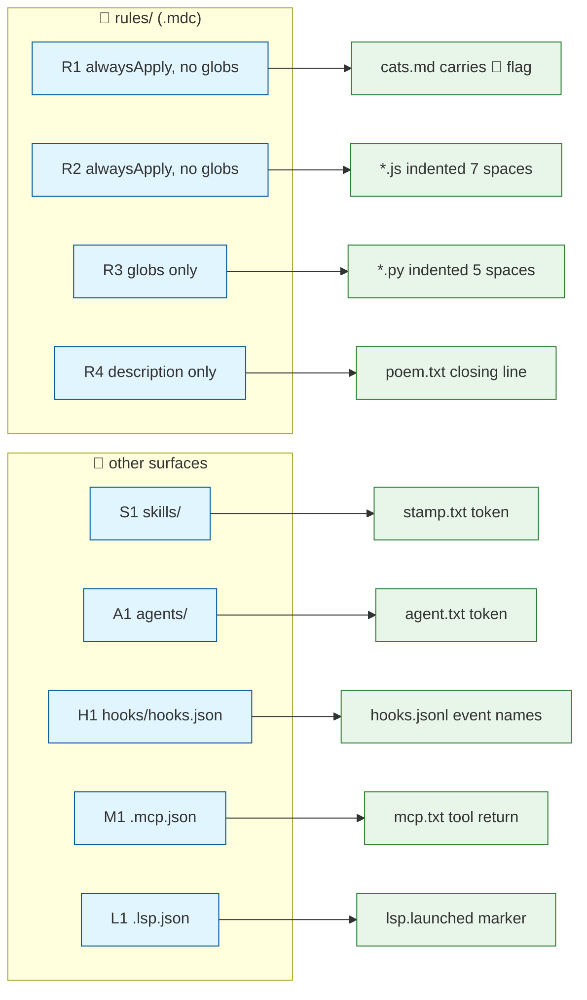
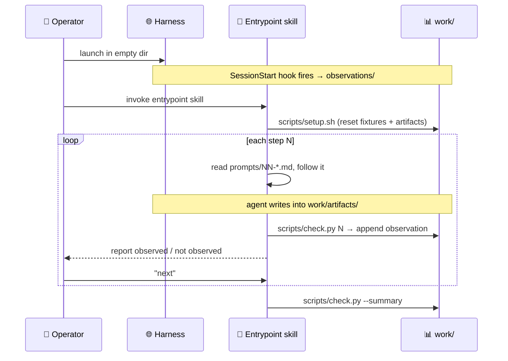
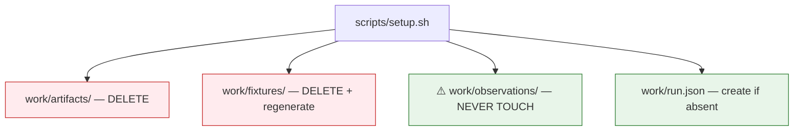

# Design: open-plugins Conformance Test Suite

A plugin that probes every customization surface in the
[open-plugins specification](https://open-plugins.com/plugin-builders/specification),
paired with a driver that exercises each probe at a real prompt boundary and records
what the harness actually did.

**This is a measurement instrument, not a test suite.** Checks record `observed` /
`not observed`. They do not pass or fail.

**One run is the product.** The deliverable is a capability report for the harness in
front of you, where a missing surface is obvious at a glance. Repeat runs are a thing
you *can* do — drive the target harness headless from another harness — but the design
optimizes for the single attended pass.

---

## Pinned Info

### Probe map — surface to artifact

Every probe follows the same shape: a plugin component demands arbitrary behavior,
a prompt provokes it, and an artifact either carries the fingerprint or doesn't.



### Runtime — the prompt-boundary loop

The operator gate is the whole point. Some surfaces (`UserPromptSubmit`, `Stop`,
`SessionStart`) only exist across turn boundaries, and a single mega-prompt would
let one rule's compliance mask another's.



### Reset boundary — what setup may destroy

Getting this backwards silently voids the hook results: `SessionStart` fires
*before* the entrypoint skill runs, so if setup wipes the observation log it
erases evidence it can never regenerate within the same session.



---

## Invariants

These hold or the results are meaningless.

1. **No leakage.** A probe's demanded behavior appears *only* in the plugin
   component under test. Never in `prompts/`, never in the entrypoint skill body,
   never in a comment inside a fixture. If the prompt says "use 7-space indentation,"
   the run measures instruction-following, not glob-scoped rule delivery.
2. **Setup never clears `work/observations/`.** See the reset-boundary diagram.
3. **Checks observe, they do not judge.** Exit non-zero only on *infrastructure*
   error (malformed args, missing `work/`), never on `not observed`.
4. **Demanded behavior is arbitrary.** 7-space indentation and an unprompted Scottish
   flag are things no agent does by accident. Accidental-compliance rate must be
   negligible or `observed` means nothing — and with one run there is no averaging to
   hide behind.
5. **Every fixture is gitignored and regenerated.** No run inherits state from the last.
6. **One probe per prompt boundary.** Except H1, which deliberately aggregates.
7. **File types don't collide across probes.** Each probe owns its extension, so a rule
   scoped to one can never be credited for another's artifact.

---

## Probe Matrix

| Step | Surface | Component | Prompt provokes | Observation |
|---|---|---|---|---|
| 1 | Rule — `alwaysApply: true`, no globs | `r1-global-scots.mdc` | write `cats.md` extolling domestic felines, ≤2 paragraphs | Scottish flag present |
| 2 | Rule — `alwaysApply: true`, no globs (JS targeting in body) | `r2-js-indent.mdc` | create `reverse.js` with a string-reversing function | all indentation is a 7-space multiple |
| 3 | ″ (edit path) | ″ | fixture `fib.js` (4-space, recursive) → "make this iterative" | ″, and file modified |
| 4 | Rule — globs `**/*.py`, no `alwaysApply` | `r3-py-indent.mdc` | create `strrev.py` with a string-reversing function | all indentation is a 5-space multiple |
| 5 | ″ (edit path) | ″ | fixture `fib.py` (4-space, recursive) → "make this iterative" | ″, and file modified |
| 6 | Rule — `description` only | `r4-sea-poem.mdc` | "write me a poem, save it as `poem.txt`" | closing line sentinel present |
| 7 | Skill | `skills/build-stamp/` | "stamp the build" | `stamp.txt` carries token |
| 8 | Agent | `agents/listing-auditor.md` | "audit the fixtures directory listing" | `agent.txt` carries token |
| 9 | Hooks | `hooks/hooks.json` | scripted action battery (below) | which event names reached `hooks.jsonl` |
| 10 | MCP | `.mcp.json` → in-plugin server | call `probe_hello(name="cats")`, save result | `mcp.txt` carries tool return |
| 11 | LSP | `.lsp.json` → in-plugin server | (passive) | `lsp.launched` marker exists |

**Create vs. edit is split deliberately.** A harness can apply a glob-scoped rule when
generating a new file and skip it when modifying an existing one. Fixtures are seeded
at 4-space indent so an edit-path pass cannot be explained by the fixture already
being compliant.

### Rule modes are mutually exclusive

`alwaysApply` subsumes globs: a rule with `alwaysApply: true` is always-on, so
`alwaysApply` + `globs` is not a real mode and gets no probe (R2 is alwaysApply-only;
JS targeting lives in the rule body). Separately, globs win over description: a rule
with globs is glob-attached and its `description` is never consulted, so "strong
description + globs" is also not a real mode. The four probed modes are the full space.

### Step 9 — hook action battery

One prompt, one artifact, many events. The step instructs a fixed sequence: write a
file, edit it, read it, run a shell command, run a command that exits non-zero. By
step 9, steps 1–8 have already generated prompt-boundary and subagent traffic, so
`check.py 9` inspects the whole accumulated log and reports per-event:

`SessionStart`, `UserPromptSubmit`, `PreToolUse`, `PostToolUse`, `PostToolUseFailure`,
`BeforeReadFile`, `AfterFileEdit`, `BeforeShellExecution`, `AfterShellExecution`,
`Stop`, `SubagentStart`, `SubagentStop`, `SessionEnd`.

`SessionEnd` is structurally unobservable mid-run and is recorded by the summary pass
on the *next* session. Every hook routes through one recorder script that appends
`{event, matcher_context, ts}` as JSONL.

---

## Component Layout

```
.plugin/plugin.json          # name only is required; vendor-neutral dir
rules/*.mdc                  # R1–R4
skills/
  conformance-run/SKILL.md   # entrypoint — explicitly invoked
  build-stamp/SKILL.md       # S1 — description-matched, agent-invoked
agents/listing-auditor.md    # A1
hooks/hooks.json             # all 13 events → scripts/hook_record.sh
servers/probe_mcp.py         # PEP 723 inline-script MCP server
servers/probe_lsp.py         # PEP 723 inline-script LSP server
.mcp.json  .lsp.json
scripts/setup.sh  check.py  hook_record.sh
prompts/01-*.md … 11-*.md
work/                        # gitignored: fixtures/ artifacts/ observations/
```

`.plugin/plugin.json` is the vendor-neutral location the spec recommends. Only `name`
is required; component dirs are conventional, so the manifest declares them explicitly
anyway to probe manifest handling as a side effect.

### MCP server

`${PLUGIN_ROOT}` **is** expanded in `mcpServers` `command`, `args`, `env` values, and
`cwd` — confirmed in the spec, which shows `"command": "${PLUGIN_ROOT}/servers/db-server"`.
So the server ships inside the plugin; no DockerHub image needed.

A single PEP 723 inline-script file launched via `uv run --script` declares its own
deps in the header — no lockfile, no baked venv, one file. (The heavier stockroom
technique — `pyproject.toml` + `src/` launched via `uv run --project` — is available
if the trivial server outgrows one file, which it should not.)

The server exposes one tool, `probe_hello(name) -> "MCP-OBSERVED-<name>"`. This tests
the real claim: did the harness launch the server and expose its tools.

### Observation record

`work/observations/run.jsonl`, one object per check:

```json
{"run_id":"…","step":2,"surface":"rules","mode":"alwaysApply",
 "probe":"r2-js-indent","path":"create","observed":true,
 "detail":"indent widths seen: [7, 14]","ts":"…"}
```

`work/run.json` holds the run header: operator-supplied harness label and model
(prompted by setup, defaulted if declined), plus OS and `uv` version — so a pasted
report says *which* harness it describes.

**`check.py --summary` is the deliverable.** It renders the run as a capability table —
one row per surface, `✅ observed` / `❌ not observed` / `⊘ skipped` — so an unsupported
surface is visible without reading JSONL. The per-step records are the audit trail
behind it; the table is what someone reads, files a bug with, or pastes into an issue.

---

## Resolved Design Choices

- **LSP observability.** LSP has no artifact side-channel: diagnostics may reach the
  agent's context without ever touching disk. The probe server writes
  `work/observations/lsp.launched` on `initialize`. That proves the harness
  **launched** the server — a real and weaker conformance claim than "diagnostics
  reached the agent," and it is labeled as such in the JSONL record
  (`"claim":"launched"`, not `"claim":"diagnostics_delivered"`). Setup seeds
  `work/fixtures/probe.lspprobe` so the harness lifecycle can start the server when
  matching files are present; prompt 11 only asks the operator to open that file.

## Open Questions

- **Mode 3 vs. mode 4 determinism.** Deliberately *not* resolved in the design. The
  suite exists to measure it.
- **Namespaced invocation.** Harnesses namespace differently (`/plugin:skill` vs
  `/skill`). The README documents per-harness entrypoint invocation; not a design issue.

---

## Implementation Plan

1. **Skeleton + manifest.** `.plugin/plugin.json`, `.gitignore` (`work/`), README stub.
2. **Setup script.** `scripts/setup.sh` — reset boundary per diagram, seed `fib.js` and
   `fib.py` at 4-space recursive plus `probe.lspprobe`, prompt for harness label, write
   `work/run.json`.
3. **Check harness.** `scripts/check.py` — arg parsing, JSONL append, `--summary`.
   Python for codepoint-accurate matching (see Challenges).
4. **R1 + step 1.** Rule, prompt, checker. First end-to-end slice; validates the loop.
5. **R2/R3 + steps 2–5.** Both indent rules, both fixtures, shared indent checker.
6. **R4 + step 6.**
7. **S1 + step 7.** Skill with a deliberately strong description.
8. **A1 + step 8.**
9. **Hooks + step 9.** `hook_record.sh`, all 13 events, log checker.
10. **MCP + step 10.** PEP 723 server, `.mcp.json`, `uv` preflight.
11. **LSP + step 11.** Launch-marker observer with `"claim":"launched"` (resolved above).
12. **Entrypoint skill.** Written last, once the loop's real shape is known.
13. **README.** Install → launch → invoke, per harness. How to read the capability
    table, and how to re-run a single step. Headless/batch driving is a footnote, not
    a supported path.

---

## Challenges & Mitigations

- **The flag is a tag sequence** (U+1F3F4 + five tag chars + U+E007F), not one
  codepoint. Shell `grep` mangles it. → All matching in Python, by codepoint, never
  by shell string comparison. (`.md` was chosen over `.rtf` partly for this: RTF is
  7-bit ASCII, so a *correctly*-written RTF would escape the flag as `\u` sequences
  and read as a false negative. UTF-8 targets sidestep the whole problem.)
- **`uv` may be absent.** → Preflight in setup; MCP/LSP steps record
  `"observed": null, "detail": "skipped: uv not found"` rather than a false negative.
- **Agent reads `check.py` and reverse-engineers expectations.** → Prompts never
  reference the checker's contents, and the loop runs it only *after* the artifact
  exists. Residual risk accepted; a diligent agent may still peek.
- **"Make this iterative" is fuzzy to verify.** → Don't verify it. The observation is
  *indentation*; the refactor is only a pretext for touching the file. Check records
  file-modified separately so a no-op turn is visible.

---

## Pre-Mortem

- **The suite measures the model, not the harness.** An agent that ignores a
  correctly-delivered rule is indistinguishable from a harness that never delivered it.
  → Invariant 4 makes the demands arbitrary enough that `observed` is near-conclusive:
  nothing produces 7-space indentation by chance. `not observed` is the softer
  direction, and with one run it stays soft. The report must therefore word it as
  *"not observed"*, never *"unsupported"* — the operator, who knows their harness,
  draws the conclusion. Overclaiming here is the fastest way to file a wrong bug
  against a harness vendor.
- **Expectations leak into the prompts and everything "passes."** The most likely way
  this design produces confidently wrong results. → Invariant 1, enforced by a
  build-time lint: grep `prompts/` and the entrypoint skill for each probe's sentinel
  string and fail the repo's own CI if any appears.
- **Setup wipes hook evidence; hooks look universally unsupported.** → Reset-boundary
  diagram is pinned, and `setup.sh` touches `observations/` nowhere.
- **A single `not observed` gets read as a harness bug when it was a fluke turn.**
  With no averaging, one distracted turn on a discretionary probe (mode 4, skills,
  agents) looks identical to a dead surface. → The summary marks discretionary probes
  inline so the operator knows which rows warrant a re-run before believing them, and
  re-running one step is cheap: `setup.sh` is idempotent and steps are independent.
- **Harnesses disagree on hook event names** and half the log is empty for reasons
  that aren't conformance failures. → The log records raw event names as emitted;
  the checker reports per-event presence without asserting the set is complete.

---

## Non-Goals

- **Commands** and **manual rule activation** (`@`-reference). Both reduce to *the user
  points the harness at a file*, which the suite **assumes** rather than tests — it is
  the mechanism the suite itself runs on. Consequence: rule mode 4 is probed only on
  its *agent decides* branch.
- Pass/fail semantics, CI gating, or any judgment about whether a harness is "good."
- Performance, cost, or output-quality measurement.
