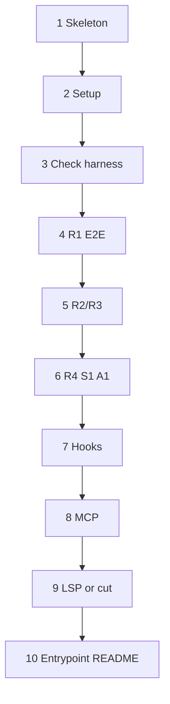

# Milestones: open-plugins-conformance-suite

## Cross-milestone invariants & constraints

These hold for every sub-run; violating any voids the measurement instrument:

1. **No expectation leakage.** Probe fingerprints and demanded behaviors appear only in the plugin component under test — never in `prompts/`, the entrypoint skill body, or fixture comments.
2. **Setup never clears `work/observations/`.** Reset may wipe `work/artifacts/` and regenerate `work/fixtures/`; observation evidence is sacred within a session.
3. **Checks observe; they do not judge.** `check.py` exits non-zero only on infrastructure errors, never on `not observed`.
4. **Demanded behavior stays arbitrary and probe-local.** Accidental-compliance rate must remain negligible; each probe owns its file type/extension so surfaces cannot credit each other.
5. **Fixtures are gitignored and regenerated.** No run inherits artifact or fixture state from the last.
6. **One probe per prompt boundary** (except H1, which deliberately aggregates hook events).
7. **Wording stays observational.** Summary and records say `observed` / `not observed` / `skipped` — never "pass/fail" or "unsupported" as a judgment.
8. **TDD in every sub-run.** Each milestone's plan must order tests before production code: script/unit tests before `setup.sh`/`check.py` behavior; observation-checker extensions before the probe component and prompt that produce the fingerprint; leakage-lint tests before entrypoint skill prose.

## Execution Order

All milestones are sequential; later surfaces depend on skeleton, setup, and the check harness.

- [ ] Create plugin skeleton: `.plugin/plugin.json`, `.gitignore` for `work/`, and a README stub — est. L2: self-contained project bootstrap with no probe logic; TDD: assert manifest/`work/` gitignore expectations before adding those files
- [ ] Implement `scripts/setup.sh` with pinned reset boundary, 4-space recursive `fib.js`/`fib.py` fixtures, harness-label prompt, and `work/run.json` header — est. L2: single setup subsystem; TDD: shell/behavioral tests for wipe-vs-preserve paths and fixture seeding before implementing `setup.sh`
- [ ] Implement `scripts/check.py` with step arg parsing, JSONL append to `work/observations/run.jsonl`, observe-not-judge exits, and `--summary` capability table — est. L3: core multi-mode observation harness used by all probes; TDD: Python tests for args, JSONL shape, summary rendering, and non-zero-only-on-infra before implementing `check.py`
- [ ] Deliver R1 end-to-end: `rules/r1-global-scots.mdc`, prompt 01, and Scottish-flag codepoint checker for `cats.md` — est. L2: first vertical slice that validates the prompt-boundary loop; TDD: flag-checker tests (including tag-sequence codepoints) before rule and prompt
- [ ] Deliver R2/R3 indent probes: alwaysApply+globs JS and globs-only Python rules, prompts 02–05, shared indent checker, and edit-path file-modified recording — est. L3: multiple components sharing indent observation logic; TDD: shared indent + modified-file checker tests before rules, fixtures, and prompts
- [ ] Deliver R4, S1, and A1 probes: description-only poem rule, `skills/build-stamp/`, `agents/listing-auditor.md`, prompts 06–08, and their token/sentinel checkers — est. L3: three discrete surface slices sharing the established check pattern; TDD: per-step sentinel/token checker tests before each component and prompt
- [ ] Deliver H1 hooks probe: `hooks/hooks.json`, `scripts/hook_record.sh`, step-09 action battery prompt, and per-event presence checker over accumulated `hooks.jsonl` — est. L3: multi-event aggregation surface with SessionEnd deferred to summary; TDD: JSONL event-presence checker tests before hooks config, recorder, and prompt
- [ ] Deliver M1 MCP probe: PEP 723 `servers/probe_mcp.py`, `.mcp.json` with `${PLUGIN_ROOT}`, prompt 10, `mcp.txt` checker, and uv-absent skip path — est. L3: in-plugin server plus config and observation claim; TDD: mcp.txt + skip-path checker tests (and server unit smoke if needed) before `.mcp.json`/server/prompt
- [ ] Resolve LSP open question: ship `.lsp.json` + PEP 723 `probe_lsp.py` writing `lsp.launched` with `claim: launched`, or explicitly cut LSP from the suite and document the cut — est. L2: bounded open-question resolution; TDD: launched-marker/skip checker tests before server/config (or cut-documentation assertions before README cut notes)
- [ ] Deliver entrypoint skill `skills/conformance-run/`, build-time sentinel-leakage lint, and README (install → launch → invoke, how to read the capability table, single-step re-run) — est. L3: driver and docs written once the loop shape is known; TDD: leakage-lint tests against planted sentinels before entrypoint skill body and README prose
