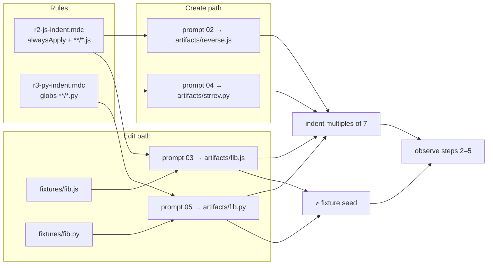

# Task: r2-r3-indent

* Task ID: r2-r3-indent
* Complexity: Level 3
* Type: feature

Deliver R2/R3 indent probes end-to-end: `rules/r2-js-indent.mdc` (alwaysApply+globs), `rules/r3-py-indent.mdc` (globs only), prompts 02–05, shared indent fingerprint checker, and edit-path file-modified recording for steps 2–5 — TDD: shared indent + modified-file checker tests before rules, fixtures assumptions, and prompts.

## Pinned Info

### Probe → artifact → check flow

Pinned because create vs edit share one indent predicate but diverge on file-modified and artifact paths; the diagram keeps that boundary visible during build.

### Invariants for this sub-run

1. No expectation leakage: 7-space demand lives only in the two rule files — never in prompts 02–05 or fixture comments.
2. Shared indent predicate for JS and Python (probe matrix Observation column: both use 7-space multiples). DESIGN probe-map diagram label "5 spaces" for `*.py` is stale; matrix + Challenges + Pre-Mortem win.
3. Create vs edit split: edit observations require indent fingerprint **and** content differing from the seeded fixture; detail reports both dimensions so a no-op turn is visible.
4. Checks observe; missing artifacts / non-compliant indent → `observed: false`, exit 0.
5. Fixtures remain setup-owned 4-space recursive seeds; this milestone does not change `setup.sh` unless a contract gap appears (expected: none — fixtures already land).
6. One probe per prompt boundary; JS vs PY extensions prevent cross-credit.

## Component Analysis

### Affected Components

- **`scripts/check.py`**: today steps 2–5 use `observe_stub`. Add pure indent helpers, file-modified helper, create/edit observers, wire `STEP_REGISTRY[2–5]`.
- **`rules/r2-js-indent.mdc`** (new): alwaysApply + globs `**/*.js`; demand 7-space (multiple) indentation on matching files.
- **`rules/r3-py-indent.mdc`** (new): globs `**/*.py`, no alwaysApply; same indent demand for Python.
- **`prompts/02-r2-js-create.md` … `05-r3-py-edit.md`** (new): provoke create/edit without naming indent widths, "7", or "spaces" as a style demand.
- **`tests/`**: new `tests/test_r2_r3_indent.py` for helpers/observers/rules/prompts; extend harness contracts in `tests/test_check.py` only if step 2–5 wiring changes shared assertions (likely CLI smoke for one indent step).
- **`scripts/setup.sh` / fixtures**: already seed `fib.js` / `fib.py` at 4-space recursive — **no change expected**; tests may assert seed inequality baseline for edit-path modified checks.
- **`DESIGN.md`**: optional non-blocking note — diagram ART3 "5 spaces" contradicts matrix; **out of scope** unless preflight demands a one-line diagram fix for operator clarity.

### Cross-Module Dependencies

- Rules → prompts: prompts must not restate rule demands; prompts name artifact paths only.
- Fixtures → edit observers: `file_modified` compares `work/artifacts/fib.{js,py}` to `work/fixtures/fib.{js,py}` (byte/text inequality after normalize newlines as needed).
- Shared indent helpers → all four step observers.
- `STEP_REGISTRY` metadata (surface/mode/probe/path) already correct for steps 2–5; only `observe` callables change.

### Boundary Changes

- Public CLI of `check.py` unchanged (`<step>` / `--summary`).
- Observation JSONL schema unchanged; `detail` vocabulary expands to include indent widths and, on edit steps, `file_modified: true|false` (observational, not judgmental).
- New rule/prompt files are additive plugin surface.

## Open Questions

None - implementation approach is clear from DESIGN probe matrix, Challenges (indent observation + file-modified recorded separately), R1 observer/registry pattern, and existing setup fixtures.

## Test Plan (TDD)

### Behaviors to Verify

- Indent widths: leading-space widths on non-blank lines → set/list of widths; blank lines ignored; no indented lines → empty widths (treat as not observed for fingerprint — nothing to credit).
- Multiples-of-7: all seen widths divisible by 7 → true; any width not divisible by 7 → false; tabs / mixed leading whitespace that is not pure spaces → not a compliant 7-space indent (fail fingerprint).
- Create observe (JS/PY): missing artifact → `observed: false`, detail names file; non-compliant indent → false + `indent widths seen: [...]`; compliant → true + widths detail.
- Edit observe: missing artifact → false; artifact equals fixture → `file_modified: false` and `observed: false` even if indent somehow compliant; artifact differs + non-compliant indent → false with both dimensions in detail; differs + compliant → `observed: true`.
- Registry/CLI: `check.py 2` (and at least one edit step) appends JSONL with correct probe/mode/path and exits 0 on not observed.
- Rule R2: frontmatter `alwaysApply: true` + globs covering `**/*.js`; body demands 7-space indentation; no Scottish-flag / other probe leakage.
- Rule R3: globs `**/*.py`, no `alwaysApply: true`; same indent demand.
- Prompts 02–05: name correct artifact (and fixture source on edit); no leakage of `7`, indent-width demands, or "spaces" as style instruction; no checker/sentinel spoilers.
- Cross-extension: JS observer ignores Python artifacts and vice versa (path selection only).

### Test Infrastructure

- Framework: pytest via `uv run pytest` (`pyproject.toml`)
- Test location: `tests/`
- Conventions: load `check.py` via `importlib` (see `tests/test_r1_scots.py`); `CONFORMANCE_WORK` tmp workdirs; observational wording bans from `tests/test_check.py`
- New test files: `tests/test_r2_r3_indent.py`
- Possibly small additions in `tests/test_check.py` for step-2 JSONL shape if not covered in the new file

### Integration Tests

- CLI step 2 with compliant `reverse.js` → stdout `observed`, JSONL `observed: true`, detail includes widths
- CLI step 3 with modified compliant `fib.js` → observed; with unmodified copy of fixture → not observed + `file_modified: false` in detail

## Implementation Plan

1. **Pure indent helpers (TDD)**
    - Files: `tests/test_r2_r3_indent.py`, `scripts/check.py`
    - Changes: add failing tests for indent-width extraction + multiples-of-N predicate; implement helpers whose **leading-space algorithm matches** `tests/test_setup.py::_indent_widths` (skip blank lines; count leading ASCII spaces only; leading tab → non-compliant marker, not a positive width). Cover empty, 4-space, 7/14, mixed, tabs. Detail format pinned to DESIGN: `indent widths seen: […]` with sorted unique positive widths.

2. **File-modified helper (TDD)**
    - Files: same
    - Changes: `file_modified(artifact: Path, fixture: Path) -> bool` — missing artifact → false; equal text → false; different → true

3. **Create-path observers (TDD)**
    - Files: same + `STEP_REGISTRY` wiring for steps 2 and 4
    - Changes: `observe_r2_js_create` / `observe_r3_py_create` (or one parameterized helper with path args) reading `work/artifacts/reverse.js` and `work/artifacts/strrev.py`; detail `indent widths seen: [...]`

4. **Edit-path observers (TDD)**
    - Files: same + registry steps 3 and 5
    - Changes: observe `work/artifacts/fib.js` / `fib.py` vs fixtures; `observed` true only if modified **and** indent fingerprint; detail includes both indent widths and `file_modified: …`

5. **Harness CLI smoke (TDD)**
    - Files: `tests/test_r2_r3_indent.py` (and/or `tests/test_check.py`)
    - Changes: assert steps 2–5 no longer return stub detail `"probe checker not implemented"`; exit 0 on not observed

6. **Rule R2 + prompt 02 (TDD)**
    - Files: `tests/test_r2_r3_indent.py`, `rules/r2-js-indent.mdc`, `prompts/02-r2-js-create.md`
    - Changes: presence/frontmatter/demand tests first; then rule + prompt (create `work/artifacts/reverse.js` string-reversing function; no indent leakage)

7. **Rule R2 edit prompt 03 (TDD)**
    - Files: tests + `prompts/03-r2-js-edit.md`
    - Changes: provoke copy/adapt from `work/fixtures/fib.js` into `work/artifacts/fib.js` and make iterative; no indent leakage

8. **Rule R3 + prompts 04–05 (TDD)**
    - Files: `rules/r3-py-indent.mdc`, `prompts/04-r3-py-create.md`, `prompts/05-r3-py-edit.md`, tests
    - Changes: globs-only rule; create `strrev.py`; edit path via `fib.py` fixture → `work/artifacts/fib.py`

9. **Full suite verification**
    - Files: none new
    - Changes: `uv run pytest` — all existing + new green; no judgment language in new details

## Technology Validation

No new technology - validation not required

## Challenges & Mitigations

- **Stale DESIGN diagram (5-space Python):** Follow probe matrix (7 for both). Do not implement a 5-space Python checker. Optional diagram fix deferred.
- **Indent measurement ambiguity (comments, tabs, mixed):** Match existing setup-test helper semantics (`_indent_widths`): only leading ASCII spaces on non-blank lines; leading tab → non-compliant; indented comment lines still count (language-agnostic). Document in helper docstring + tests. Do **not** invent a second indent dialect.
- **Empty / single-line no-indent files:** No positive widths → not observed (cannot credit indent delivery). Detail explains no indented lines / widths `[]`.
- **Edit no-op vs indent failure:** Detail always carries `file_modified` on edit steps so operators can distinguish; `observed` requires both.
- **Prompt leakage of "7" / "indent":** Focused absence tests on prompts (mirror R1). Build-time sentinel lint remains a later milestone.
- **`test_step_append_shape` uses step 1:** Wiring 2–5 should not break it; still run full suite.
- **Agent writes edit result into fixtures instead of artifacts:** Prompts must state artifacts paths clearly; checker only credits `work/artifacts/fib.*`.

## Pre-Mortem

- **Built 5-space Python because the mermaid label said so:** Plan pins matrix authority; Challenge already covers. Add explicit invariant #2 so build cannot "helpfully" diverge.
- **Treated file-modified as detail-only and marked edit steps observed on indent alone:** Would hide no-ops. Implementation step 4 and behaviors require both for `observed: true`.
- **Put indent demands in prompts "to help the model":** Violates instrument validity. Leakage tests are a hard gate before prompts are considered done.
- **Over-scoped into setup.sh rewrite or DESIGN rewrite:** Fixtures already exist; diagram fix is non-blocking. Scope stays checkers → rules → prompts.

## Status

- [x] Component analysis complete
- [x] Open questions resolved
- [x] Test planning complete (TDD)
- [x] Implementation plan complete
- [x] Technology validation complete
- [x] Pre-Mortem complete
- [x] Preflight
- [ ] Build
- [ ] QA

## Preflight Findings

- **PASS** — TDD ordering explicit per implementation step; conventions match R1 observer/registry pattern; setup fixtures already present; no blocking conflicts.
- **Amendment:** Indent helper must reuse `tests/test_setup.py::_indent_widths` semantics (not a new dialect); detail string pinned to DESIGN example shape.
- **Advisory:** Optionally fix DESIGN mermaid ART3 ("5 spaces" → "7 spaces") in a later docs pass — not required for this sub-run.
