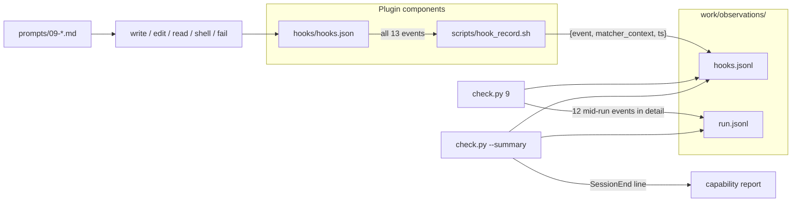

# Task: h1-hooks-probe

* Task ID: h1-hooks-probe
* Complexity: Level 3
* Type: feature

Deliver the H1 hooks probe: `hooks/hooks.json` routing all 13 DESIGN events through `scripts/hook_record.sh`, prompt 09 (action battery), step-9 per-event presence observer over `work/observations/hooks.jsonl`, and SessionEnd reporting deferred to `--summary`.

## Pinned Info

### H1 evidence flow

Why pinned: H1 is the only probe that aggregates many events from one log and splits mid-run observation from SessionEnd summary reporting.

### Invariants & Constraints

Must preserve / must hold for this plan:

1. No expectation leakage — event names / recorder paths may appear in `hooks.json` and `hook_record.sh`; fingerprints and demanded behavior stay out of `prompts/09-*.md`.
2. Setup never clears `work/observations/` — `hooks.jsonl` lives under observations so SessionStart / SessionEnd evidence survives reset.
3. Checks observe; they do not judge — incomplete event sets are still valid observations; exit non-zero only on infra errors.
4. One probe per prompt boundary **except H1** — step 9 aggregates; SessionEnd is deferred to summary.
5. Wording stays observational (`observed` / `not observed` / `skipped`).
6. TDD: JSONL event-presence helper/observer tests before hooks config, recorder, and prompt.
7. Use `${PLUGIN_ROOT}` in `hooks.json` (open-plugin-spec / DESIGN), not vendor-specific roots.
8. `hooks.json` uses the plugin wrapper shape: top-level `{"hooks": { … }}`.

## Component Analysis

### Affected Components

- **`scripts/check.py`**: Steps 1–8 observers live; step 9 is `observe_stub`. → Add hooks JSONL helpers, `observe_h1_hooks`, bind `STEP_REGISTRY[9]`, extend `render_summary` for SessionEnd. Update module docstring (9 implemented; 10–11 stubs).
- **`scripts/hook_record.sh`**: Missing. → New recorder: append `{event, matcher_context, ts}` to `work/observations/hooks.jsonl` (respect `CONFORMANCE_WORK` / `$PLUGIN_ROOT/work`).
- **`hooks/hooks.json`**: Missing (manifest already points here). → Register all 13 DESIGN events → `command` hooks calling `hook_record.sh` with the event name; broad matchers so presence can be credited.
- **`prompts/09-*.md`**: Missing. → Action battery: write a file, edit it, read it, run a shell command, run a command that exits non-zero. No checker/event-name leakage.
- **`tests/test_h1_hooks.py`**: Missing. → New suite (helpers → observer → CLI → summary SessionEnd → recorder → hooks.json → prompt/leakage).
- **`tests/test_check.py`**: Uses step 9 via monkeypatch for skip wording; plants step-9 summary row. → Should keep working; no intentional rewrite unless a hard assertion against stub detail appears (none today).
- **`.plugin/plugin.json` / `DESIGN.md` / README**: Manifest already declares hooks path; DESIGN already specifies H1. → No doc/manifest edits required in this milestone.

### Cross-Module Dependencies

- Harness → `hooks.json` → `hook_record.sh` → `hooks.jsonl`
- Operator prompt 09 → agent actions → hook events → same log
- `check.py 9` → reads `hooks.jsonl` → appends step-9 row to `run.jsonl`
- `check.py --summary` → reads `run.jsonl` for table + `hooks.jsonl` for SessionEnd line

### Boundary Changes

- **Step 9 observer contract (new):**
  - Log path: `work/observations/hooks.jsonl`
  - Mid-run event set (12): all DESIGN events except `SessionEnd`
  - Missing / unreadable log → `observed=false`, detail names `hooks.jsonl`
  - Empty log or no mid-run events → `observed=false`, detail lists all 12 mid-run events as absent
  - Any mid-run event present → `observed=true`, detail lists per-event presence for all 12 mid-run events (never require the full set)
  - `SessionEnd` is **not** part of step-9 `observed` / detail
- **Summary contract (extension):** After the capability table, print one observational SessionEnd line derived from `hooks.jsonl` presence (`SessionEnd: ✅ observed` / `❌ not observed`). Do not invent a new step number or rewrite step-9 JSONL. Absence of the log → not observed.
- **Recorder contract:** Each invocation appends one JSONL object: `event` (string arg), `matcher_context` (string; from stdin JSON if present else empty/`-`), `ts` (UTC ISO). Exit 0 on successful append; create parent dirs as needed.

## Open Questions

None — implementation approach is clear from DESIGN.md (action battery, 13 events, recorder shape, SessionEnd deferred to summary, per-event presence without completeness assertion), open-plugin-spec hooks wrapper + `${PLUGIN_ROOT}`, and the established R2/R4 observer+detail pattern.

## Test Plan (TDD)

### Behaviors to Verify

- Parse hooks JSONL → set of distinct event names (ignore blank lines; skip/tolerate bad lines without infra exit from observer)
- Format mid-run detail → stable string covering all 12 mid-run events with present/absent markers
- Missing `hooks.jsonl` → not observed; detail mentions file
- Empty log → not observed; all 12 mid-run marked absent
- Partial mid-run set (e.g. only `SessionStart` + `PreToolUse`) → observed; detail shows present/absent; incomplete set is fine
- Only `SessionEnd` in log → step 9 not observed (SessionEnd excluded from mid-run); summary reports SessionEnd observed
- Mid-run events present + SessionEnd present → step 9 observed; summary SessionEnd observed
- CLI step 9 → exit 0; JSONL fields `hooks` / `events` / `h1-hooks-battery` / `aggregate`; non-stub detail; no judgment language
- CLI `--summary` → prints SessionEnd status line; exit 0 even when SessionEnd absent
- Malformed args / missing work still infra-fail (existing harness tests; do not regress)
- `hook_record.sh EventName` → appends valid JSON line under `CONFORMANCE_WORK/observations/hooks.jsonl`
- `hooks/hooks.json` → wrapper `hooks` object; all 13 event keys; each routes a `command` using `${PLUGIN_ROOT}/scripts/hook_record.sh` and the event name
- Prompt 09 → instructs write/edit/read/shell/fail sequence; no `hooks.jsonl`, no event-name laundry list as expectations, no `check.py`, no `\bobserved\b` leakage patterns used by prior suites

### Test Infrastructure

- Framework: pytest via `uv run pytest` (`pyproject.toml`)
- Test location: `tests/`
- Conventions: `importlib` load of `scripts/check.py`; `CONFORMANCE_WORK` + `tmp_path`; helpers → observers → CLI → components → leakage (see `tests/test_r4_s1_a1.py`)
- New test files: `tests/test_h1_hooks.py`
- Shell recorder: subprocess invoke with env `CONFORMANCE_WORK` / optional `PLUGIN_ROOT`

### Integration Tests

- CLI step 9 with planted `hooks.jsonl` → JSONL observation row + stdout phrase
- CLI `--summary` with/without SessionEnd lines in `hooks.jsonl`
- Recorder → observer path: run `hook_record.sh`, then `observe_h1_hooks` sees the event

## Implementation Plan

1. **Helpers + mid-run constants (TDD)**
    - Files: `tests/test_h1_hooks.py`, `scripts/check.py`
    - Changes: `MID_RUN_HOOK_EVENTS` / `SESSION_END_EVENT` (or equivalent), `hooks_log_path(work)`, `event_names_from_hooks_jsonl(path)`, `format_hook_events_detail(present: set[str])` covering the 12 mid-run names. Hooks JSONL parse must be **per-line tolerant** (skip blank/malformed lines) — do not call `_load_jsonl` as-is (it raises on bad JSON and would turn garbage log lines into infra failures).

2. **`observe_h1_hooks` + registry bind (TDD)**
    - Files: `tests/test_h1_hooks.py`, `scripts/check.py`
    - Changes: implement observer per Boundary Changes; `STEP_REGISTRY[9]` `observe=observe_h1_hooks`; assert registry wiring; update module docstring

3. **CLI step 9 smoke (TDD)**
    - Files: `tests/test_h1_hooks.py`
    - Changes: observed / not-observed / exit-0 / metadata / detail content tests

4. **SessionEnd in `render_summary` (TDD)**
    - Files: `tests/test_h1_hooks.py`, `scripts/check.py`
    - Changes: print SessionEnd observational line from `hooks.jsonl` whenever `run.json` is valid — including the `(no observations recorded)` path — so SessionEnd is not gated on `run.jsonl` rows; keep exit semantics

5. **`scripts/hook_record.sh` (TDD)**
    - Files: `tests/test_h1_hooks.py`, `scripts/hook_record.sh`
    - Changes: executable recorder; work-dir resolution aligned with setup/check; stdin → `matcher_context`; append JSONL

6. **`hooks/hooks.json` (TDD)**
    - Files: `tests/test_h1_hooks.py`, `hooks/hooks.json`
    - Changes: all 13 events → command hooks to `${PLUGIN_ROOT}/scripts/hook_record.sh <EventName>` with broad matchers (`.*` or omit per event rules)

7. **Prompt 09 (TDD)**
    - Files: `tests/test_h1_hooks.py`, `prompts/09-h1-hooks-battery.md` (name may vary; keep `09-` prefix)
    - Changes: action battery prose only; leakage assertions

8. **Full suite verification**
    - Files: none new
    - Changes: `uv run pytest` entire suite green; confirm `test_check.py` skip/summary cases still pass

## Technology Validation

No new technology — validation not required. Shell + Python + pytest already in use; hooks.json is static config per open-plugin-spec.

## Challenges & Mitigations

- **Harness event-name drift / partial support:** DESIGN pre-mortem — record raw names; report per-event presence; never require the full set. Detail lists the DESIGN mid-run catalog with yes/no, not a judgment of harness quality.
- **`matcher_context` stdin shape varies by host:** Store a compact string (prefer JSON `matcher` / tool name fields if obvious; else truncated raw stdin or `-`). Presence of `event` is the conformance claim; matcher_context is audit aid.
- **SessionEnd only appears after session ends:** Documented structurally; summary reads whatever is in the accumulated log. No session-id filtering in this milestone (single-run work tree).
- **`test_check.py` uses step 9 as skip monkeypatch target:** Keep that pattern; do not remove step 9 from registry. New tests live in `test_h1_hooks.py`.
- **Hook script work-dir discovery:** Mirror `check.py` / `setup.sh` (`CONFORMANCE_WORK` else `$PLUGIN_ROOT/work`); derive `PLUGIN_ROOT` from script location when unset.
- **Broad matchers may fire often:** Intended — H1 measures delivery of events, not selectivity.

## Pre-Mortem

- **Plan treated incomplete event sets as failure:** Would violate DESIGN pre-mortem and observe-not-judge. → Boundary Changes already require partial sets → `observed=true` with detail; Challenge 1 covers it.
- **`hooks.jsonl` placed under `artifacts/` and wiped by setup:** Would erase SessionStart evidence. → Path fixed under `observations/`; invariant #2.
- **Step 9 credited SessionEnd mid-run:** Would over-claim. → SessionEnd excluded from mid-run set; summary-only line.
- **Prompt listed every event name as a checklist:** Leakage / agent coaching. → Prompt only describes the action battery; leakage tests gate event-name laundry lists and checker references.
- **Used `${CLAUDE_PLUGIN_ROOT}` instead of `${PLUGIN_ROOT}`:** Vendor lock-in vs DESIGN/MCP precedent. → Invariant #7 + hooks.json tests assert `${PLUGIN_ROOT}`.

## Status

- [x] Component analysis complete
- [x] Open questions resolved
- [x] Test planning complete (TDD)
- [x] Implementation plan complete
- [x] Technology validation complete
- [x] Pre-Mortem complete
- [x] Preflight
- [x] Build
- [x] QA

## Preflight Amendments

- Helpers: tolerant per-line hooks JSONL parse (do not reuse raising `_load_jsonl`).
- Summary: SessionEnd line prints even when `run.jsonl` is empty.

## Build Notes

- Implementation plan steps 1–8 completed via TDD (`tests/test_h1_hooks.py` first; 19 new tests).
- Judgment-language assertion in H1 suite uses word boundaries so `PostToolUseFailure` is not a false positive.
- Full suite: `uv run pytest` → 112 passed.

## QA Results

- **Status:** PASS (`.qa-validation-status`)
- **Finding (fixed):** `event_names_from_hooks_jsonl` swallowed `OSError`, making the planned unreadable-log detail path dead; OSError now propagates; summary treats unreadable as SessionEnd not observed.
- **Otherwise:** Plan complete; KISS/DRY/YAGNI clean; no TODOs/debug debris; docs scoped as planned (no README/manifest edits).
