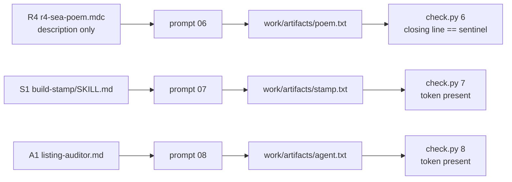

# Task: r4-s1-a1-probes

* Task ID: r4-s1-a1-probes
* Complexity: Level 3
* Type: feature

Deliver R4 (description-only sea-poem rule), S1 (`skills/build-stamp/`), and A1 (`agents/listing-auditor.md`) with prompts 06–08 and per-step token/sentinel checkers wired into `check.py` steps 6–8. TDD: checker contracts before each component and prompt.

## Pinned Info

### Probe → artifact → observation

Three independent create-path slices sharing one helper shape (substring/line presence), not each other.

### Fingerprints (probe-local; never in prompts)

| Step | Probe | Artifact | Fingerprint |
|---|---|---|---|
| 6 | R4 | `poem.txt` | Closing line (last non-empty line, stripped) **equals** `SEA-POEM-OBSERVED` |
| 7 | S1 | `stamp.txt` | File text **contains** `BUILD-STAMP-OBSERVED` |
| 8 | A1 | `agent.txt` | File text **contains** `LISTING-AUDITOR-OBSERVED` |

## Component Analysis

### Affected Components

- **`scripts/check.py`**: Steps 6–8 currently stub observers (`observe_stub`). Add shared presence helpers + three observers; wire into existing `STEP_REGISTRY` entries (already have correct `surface`/`mode`/`probe`/`path` metadata).
- **`rules/r4-sea-poem.mdc`** (new): Description-only rule — frontmatter has `description` only (no `alwaysApply`, no `globs`). Body demands poem saved as `poem.txt` with closing line exactly `SEA-POEM-OBSERVED`.
- **`skills/build-stamp/SKILL.md`** (new): Agent-skills format (`name: build-stamp` matching dir; strong `description` for description-matched invocation). Body demands writing `stamp.txt` with token `BUILD-STAMP-OBSERVED`.
- **`agents/listing-auditor.md`** (new): Agent definition with strong description for audit/listing tasks. Body demands writing `agent.txt` with token `LISTING-AUDITOR-OBSERVED`.
- **`prompts/06-r4-poem.md`**, **`07-s1-stamp.md`**, **`08-a1-audit.md`** (new): Provoke poem / stamp-the-build / audit-fixtures-listing; name artifact paths; **no** fingerprint leakage.
- **`tests/test_r4_s1_a1.py`** (new): All TDD contracts for helpers, observers, CLI, components, prompts.
- **`DESIGN.md`**: No matrix row changes expected (already specifies steps 6–8); only touch if build surfaces a stale label — otherwise leave alone.
- **`.plugin/plugin.json`**: Already declares `skills` and `agents` paths — no change unless tests prove otherwise.

### Cross-Module Dependencies

- Prompts → artifacts under `work/artifacts/` (same layout as R1–R3).
- Components → checkers: fingerprints live only in component bodies; checkers read artifacts only.
- `check.py` registry metadata already names probes; observers must match those names in JSONL.
- No dependency between R4 / S1 / A1 — can implement as three TDD slices after shared helper.

### Boundary Changes

- Public CLI: steps 6–8 change from stub `not observed` / `"probe checker not implemented"` to real observers (still exit 0 on not observed).
- No new CLI flags, no setup.sh changes, no fixture seeding for these create-path probes.

### Invariants & Constraints

1. No expectation leakage: sentinels/tokens appear only in the component under test — never in prompts, fixtures, or (later) entrypoint skill.
2. Checks observe, do not judge: missing fingerprint → `observed: false`, exit 0.
3. Demanded behavior is arbitrary and probe-local; distinct tokens prevent cross-credit.
4. File types do not collide: `.txt` artifacts with distinct basenames (`poem` / `stamp` / `agent`).
5. R4 is description-only: no `alwaysApply`, no `globs` (DESIGN: globs would subsume description).
6. S1 description must be strong enough for description-matched invocation on "stamp the build" wording.
7. Closing-line semantics for R4: last non-empty line after stripping trailing whitespace must **equal** the sentinel (not merely contain it somewhere).
8. TDD: helper/observer tests before components and prompts.

## Open Questions

None — implementation approach is clear from DESIGN matrix + R1 presence-checker pattern. Fingerprint strings are probe inventions (same class as Scots flag / indent N), fixed in Pinned Info above.

## Test Plan (TDD)

### Behaviors to Verify

**Shared helpers**

- `last_nonempty_line(text)` → strips; empty / whitespace-only → `""`; multi-line → last non-empty stripped line.
- `artifact_contains(path, token)` → missing file False; present+absent token False; present+token True.
- `closing_line_equals(path, sentinel)` → missing False; last non-empty ≠ sentinel False; equals True (trailing newline / blank trailing lines ignored).

**Step 6 R4**

- Missing `poem.txt` → not observed; detail names file.
- Poem without sentinel closing line → not observed.
- Poem with sentinel only mid-file → not observed (not closing line).
- Poem with last non-empty line `SEA-POEM-OBSERVED` → observed.
- CLI `check.py 6` with compliant file → exit 0, stdout observed, JSONL `probe: r4-sea-poem`, `mode: description`, `observed: true`.
- Rule file: `description:` present; `alwaysApply` absent; `globs:` absent; body demands sentinel + `poem.txt`.
- Prompt 06: provokes poem + `work/artifacts/poem.txt`; no `SEA-POEM-OBSERVED` / checker spoilers.

**Step 7 S1**

- Missing / token-absent / token-present observers for `stamp.txt`.
- CLI step 7 JSONL: `surface: skills`, `probe: s1-build-stamp`, `mode: description`.
- `SKILL.md`: frontmatter `name: build-stamp`; description includes stamp/build trigger language; body demands token + `stamp.txt`; token not in description-only leak to prompts (token may be in skill body only — prompts must not have it).
- Prompt 07: "stamp the build" (or equivalent); names `work/artifacts/stamp.txt`; no token leakage.

**Step 8 A1**

- Same observer pattern for `agent.txt` / `LISTING-AUDITOR-OBSERVED`.
- CLI step 8 JSONL: `surface: agents`, `probe: a1-listing-auditor`, `mode: description`.
- Agent file: strong description for fixtures-directory listing audit; body demands token + `agent.txt`.
- Prompt 08: audit fixtures directory listing; names `work/artifacts/agent.txt`; no token leakage.

**Cross-probe**

- Compliant poem does not satisfy stamp/agent observers (wrong path).
- Prompt leakage bans are per-fingerprint (each prompt tested against all three tokens).

### Test Infrastructure

- Framework: pytest via `uv run pytest` (`pyproject.toml`)
- Test location: `tests/`
- Conventions: `importlib` load of `check.py` (see `tests/test_r1_scots.py`); `CONFORMANCE_WORK` tmp workdirs; observational wording; prompt absence tests
- New test files: `tests/test_r4_s1_a1.py`

### Integration Tests

- CLI steps 6–8 with compliant artifacts → observed + correct registry fields
- CLI steps 6–8 without artifacts → not observed, exit 0 (not infra error)

## Implementation Plan

1. **Shared text helpers (TDD)**
    - Files: `tests/test_r4_s1_a1.py`, `scripts/check.py`
    - Changes: failing tests then implement `last_nonempty_line`, `artifact_contains`, `closing_line_equals` (or equivalent thin wrappers).

2. **R4 observer + registry wire (TDD)**
    - Files: same
    - Changes: `observe_r4_sea_poem`; bind step 6; missing/mid-file/closing-line cases.

3. **S1 observer + registry wire (TDD)**
    - Files: same
    - Changes: `observe_s1_build_stamp`; bind step 7.

4. **A1 observer + registry wire (TDD)**
    - Files: same
    - Changes: `observe_a1_listing_auditor`; bind step 8.

5. **CLI smoke for steps 6–8 (TDD)**
    - Files: `tests/test_r4_s1_a1.py`
    - Changes: subprocess checks for observed / not observed / JSONL shape; confirm stub detail gone.

6. **Rule R4 + prompt 06 (TDD)**
    - Files: tests, `rules/r4-sea-poem.mdc`, `prompts/06-r4-poem.md`
    - Changes: assert description-only frontmatter + body demand; then write rule and prompt.

7. **Skill S1 + prompt 07 (TDD)**
    - Files: tests, `skills/build-stamp/SKILL.md`, `prompts/07-s1-stamp.md`
    - Changes: assert `name`/`description`/body token; strong description for "stamp the build"; then write skill and prompt.

8. **Agent A1 + prompt 08 (TDD)**
    - Files: tests, `agents/listing-auditor.md`, `prompts/08-a1-audit.md`
    - Changes: assert description + body token; then write agent and prompt.

9. **Full suite verification**
    - Files: none new
    - Changes: `uv run pytest` — all existing + new green.

## Technology Validation

No new technology - validation not required

## Challenges & Mitigations

- **Closing-line vs contains confusion:** Pin equality on last non-empty line; tests include mid-file sentinel → not observed.
- **Prompt / description leakage of tokens:** Per-prompt absence tests for all three fingerprints; rule/skill/agent *bodies* hold tokens; skill/agent *descriptions* may use trigger phrases but must not include tokens.
- **Weak skill/agent description → never invoked at attended run:** Description must echo prompt intent ("stamp the build", "audit … fixtures … listing") per DESIGN "deliberately strong description."
- **R4 accidentally ships `alwaysApply` or `globs`:** Frontmatter tests forbid both.
- **Cross-credit via shared `.txt`:** Distinct basenames + path-scoped observers.
- **Agent file format variance across harnesses:** Keep `listing-auditor.md` as markdown with YAML frontmatter (`name` + `description`) + body instructions — mirrors skill metadata shape; DESIGN path is authoritative.

## Pre-Mortem

- **Treated R4 as "sentinel anywhere" and credited mid-poem leaks:** Would over-claim description-rule delivery. Closing-line equality tests block that.
- **Put fingerprints in prompts "so the model knows what to write":** Leakage tests are a hard gate; violates invariant 1.
- **Shipped R4 with alwaysApply "just to make it work":** Would measure the wrong rule mode. Frontmatter negative tests + DESIGN four-mode space.
- **Skill description too vague; attended run never loads S1:** Strong-description requirement + prompt wording aligned to description keywords.
- **Over-scoped into entrypoint leakage lint or summary discretionary markers:** Those belong to later milestones; this sub-run stops at steps 6–8 components + checkers.

## Implementation Checklist

- [ ] 1. Shared text helpers (TDD)
- [ ] 2. R4 observer + registry wire (TDD)
- [ ] 3. S1 observer + registry wire (TDD)
- [ ] 4. A1 observer + registry wire (TDD)
- [ ] 5. CLI smoke for steps 6–8 (TDD)
- [ ] 6. Rule R4 + prompt 06 (TDD)
- [ ] 7. Skill S1 + prompt 07 (TDD)
- [ ] 8. Agent A1 + prompt 08 (TDD)
- [ ] 9. Full suite verification

## Status

- [x] Component analysis complete
- [x] Open questions resolved
- [x] Test planning complete (TDD)
- [x] Implementation plan complete
- [x] Technology validation complete
- [x] Pre-Mortem complete
- [x] Preflight
- [ ] Build
- [ ] QA

## Preflight Findings

- **PASS** — TDD ordering explicit per implementation step (helpers → observers → CLI → components/prompts); conventions match R1 observer/registry pattern; registry metadata for steps 6–8 already present; no overlapping implementations or stub-expectation tests to update.
- **Advisory:** A future entrypoint-milestone leakage lint could centralize the three fingerprint strings in one constant table — out of scope here; prompts/components remain the enforcement surface for this sub-run.
