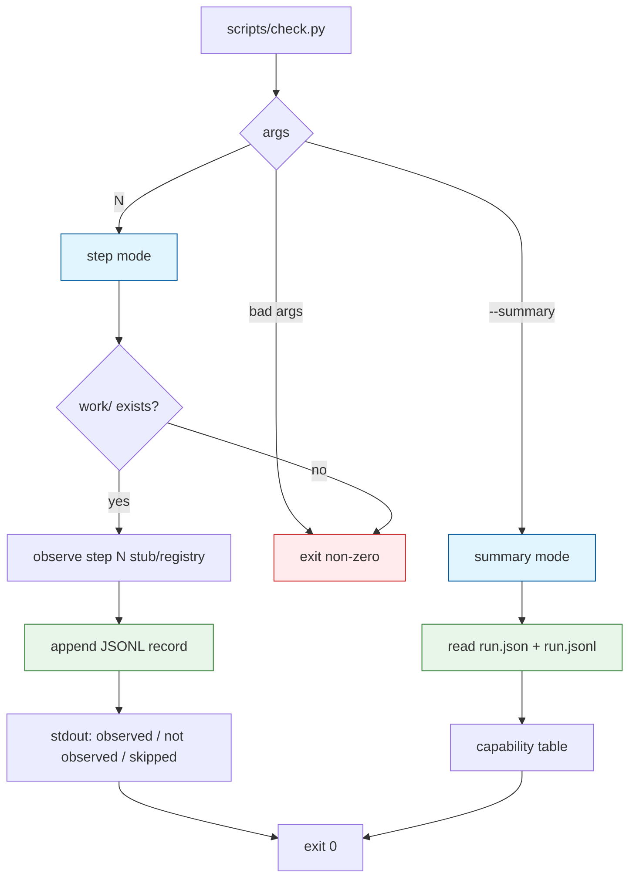

# Task: check-harness

* Task ID: check-harness
* Complexity: Level 3
* Type: feature

Implement `scripts/check.py` as the observe-not-judge harness: parse step / `--summary` args, append one JSONL observation per step check to `work/observations/run.jsonl`, exit non-zero only on infrastructure errors, and render a capability table from recorded observations. Probe-specific fingerprint logic is stubbed here and replaced by later milestones.

## Pinned Info

### Check harness modes

CLI has two modes; step mode appends audit-trail records, summary mode renders the deliverable table. Both honor observe-not-judge exits.

### Pinned decisions (no creative phase)

1. **Row grain:** `--summary` emits **one row per step that has a JSONL record** (steps 1–11 identity from a static registry). Partial runs omit unchecked steps. H1 per-event expansion is deferred to the hooks milestone; step 9 is a single aggregate row until then.
2. **Status vocabulary:** `observed: true` → `✅ observed`; `false` → `❌ not observed`; `null` → `⊘ skipped`. Never "pass/fail" or "unsupported."
3. **`run_id`:** On first successful step append, ensure `work/run.json` has a `run_id` (UUID4). If absent, generate and write it back; all records in that run reuse it. If `run.json` itself is missing, that is an infrastructure error (setup must have run).
4. **Stub observers:** Steps 1–11 are registered with metadata (`surface`, `mode`, `probe`, `path`) and stub `observe()` callables that return `observed: false` with detail `probe checker not implemented`. Later milestones replace per-step callables; this milestone locks CLI, JSONL shape, exits, and summary.
5. **Work root:** Same `CONFORMANCE_WORK` override as `setup.sh`; default `$PLUGIN_ROOT/work`.
6. **`observations/` creation:** Step mode may `mkdir` `work/observations/` when appending (hooks create it in attended runs; tests and early steps must not depend on hooks).

## Component Analysis

### Affected Components
- `scripts/check.py` (new): CLI, step registry, stub observers, JSONL append, summary renderer, exit policy
- `work/observations/run.jsonl` (runtime artifact): append-only audit trail
- `work/run.json` (existing from setup): read header fields; may gain `run_id` on first check
- `tests/test_check.py` (new): TDD contracts for args, JSONL, exits, summary
- Later probe milestones (out of scope): replace stub observers with real fingerprint checkers

### Cross-Module Dependencies
- setup → check: `run.json` must exist before step/summary meaningful use; `CONFORMANCE_WORK` seam shared
- check → future probes: registry callables are the extension point
- entrypoint skill (future): will invoke `check.py N` and `check.py --summary`

### Boundary Changes
- New public CLI: `scripts/check.py <step>` and `scripts/check.py --summary`
- New observation record schema (JSONL lines) as specified in DESIGN.md
- Optional additive `run_id` field on `work/run.json`

### Invariants & Constraints
- Must exit non-zero only on infrastructure errors (bad args, missing `work/`, missing `run.json`, I/O failure) — never on `not observed` / `skipped`
- Must use observational wording only (`observed` / `not observed` / `skipped`)
- Must not clear or rewrite prior JSONL lines (append only)
- Must not implement probe fingerprint logic in this milestone (stubs only)
- Must reuse `CONFORMANCE_WORK` convention from setup
- TDD: tests before `check.py` implementation

## Open Questions

None - implementation approach is clear from DESIGN.md plus pinned decisions above.

## Test Plan (TDD)

### Behaviors to Verify

- [Usage / bad args]: `check.py` with no args, non-integer step, or unknown flag → non-zero exit; no JSONL line appended
- [Missing work/]: `CONFORMANCE_WORK` pointing at nonexistent work root → non-zero exit
- [Missing run.json]: work dir exists but no `run.json` → non-zero exit
- [Step append shape]: `check.py 1` with valid work+run.json → appends exactly one JSONL object with keys `run_id`, `step`, `surface`, `mode`, `probe`, `path`, `observed`, `detail`, `ts`; stub yields `observed: false`
- [Observe-not-judge]: stub `not observed` → exit code 0; stdout/stderr conveys `not observed` (not pass/fail language)
- [Skipped status]: when an observation has `observed: null` (planted or via test double) → exit 0 and wording includes `skipped`
- [Append-only]: two step invocations → two JSONL lines; first line unchanged
- [run_id stable]: first check writes `run_id` into `run.json`; second check reuses the same `run_id` in the new record
- [Summary empty]: `--summary` with empty/missing JSONL (but valid run.json) → exit 0; table has no probe rows (or explicit empty state) without judgment language
- [Summary statuses]: planted JSONL with true / false / null → table shows `✅ observed` / `❌ not observed` / `⊘ skipped` respectively
- [Summary header]: `--summary` includes harness/model (and ideally OS/uv) from `run.json`
- [Unknown step]: step outside 1–11 → non-zero infra exit
- [CONFORMANCE_WORK]: checks mutate only the overridden work tree, not repo `work/`

### Test Infrastructure

- Framework: pytest via `uv run pytest` (existing)
- Test location: `tests/`
- Conventions: `test_*.py`, plain assert, `tmp_path` + `CONFORMANCE_WORK` as in `tests/test_setup.py`
- New test files: `tests/test_check.py`
- Import seam: tests may import `check.py` via `importlib` for unit-level registry/summary helpers; CLI contracts also covered via `subprocess` (`python3 scripts/check.py …`)

### Integration Tests

- [CLI subprocess round-trip]: invoke `check.py 2` then `check.py --summary` against the same temp work tree → summary row reflects the appended stub observation
- [Coexistence with setup]: run `setup.sh` then `check.py 1` under same `CONFORMANCE_WORK` → observations preserved; fixtures/artifacts untouched by check

## Implementation Plan

1. Write failing check-harness contract tests (TDD red)
   - Files: `tests/test_check.py`
   - Changes: temp work + minimal `run.json`; subprocess/import against `scripts/check.py`; cover behaviors above
2. Implement `scripts/check.py` CLI + registry + stub observers + JSONL append + summary (TDD green)
   - Files: `scripts/check.py` (new)
   - Changes:
     - Resolve `PLUGIN_ROOT` / `WORK_DIR` (`CONFORMANCE_WORK` override)
     - Arg parse: exactly one of integer step in `1..11` or `--summary`
     - Infra checks: work dir exists; `run.json` exists and parses
     - `STEP_REGISTRY`: metadata for steps 1–11 matching DESIGN probe matrix (`surface`, `mode`, `probe`, `path` create|edit|null as appropriate)
     - Stub `observe(step, work) -> {observed: false, detail: "probe checker not implemented"}`
     - Ensure `run_id` on `run.json`; append one JSON line to `work/observations/run.jsonl`; print observational status; exit 0
     - `--summary`: load header + JSONL; print capability table (one row per recorded step) with emoji status vocabulary; exit 0 even when all `not observed`
3. Confirm full self-check suite green
   - Files: none (verification only)
   - Changes: `uv run pytest` — skeleton + setup + check contracts

## Technology Validation

No new technology - validation not required. Stdlib + existing pytest/`uv` self-check harness. Python choice already mandated by DESIGN (codepoint-accurate matching for later checkers).

## Challenges & Mitigations

- [Subprocess vs import testing friction]: Prefer importlib for pure helpers (summary render, record shape); subprocess for exit-code/CLI contracts
- [Stub detail leaking into "real" early runs]: Acceptable until probe milestones replace callables; document in module docstring that stubs are temporary
- [Accidental judgment wording in summary]: Tests assert exact status tokens; ban pass/fail/unsupported strings
- [Rewriting run.json clobbers harness/model]: When adding `run_id`, read-modify-write preserving existing keys
- [H1 summary expectations creeping in]: Explicitly out of scope — single aggregate stub row for step 9 only

## Pre-Mortem

- [Plan tried to ship real probe checkers and ballooned past the milestone]: already scoped by stub-observer pinned decision — do not add fingerprint logic here
- [Summary collapsed all rules into one "rules" row and hid create/edit gaps]: pinned row grain is per recorded step with registry identity — tests plant create vs edit steps separately
- [Infra vs observation exit policy inverted under "helpful" defaults]: Challenge covered by dedicated observe-not-judge tests; treat any non-zero on `not observed` as plan failure

## Status

- [x] Component analysis complete
- [x] Open questions resolved
- [x] Test planning complete (TDD)
- [x] Implementation plan complete
- [x] Technology validation complete
- [x] Pre-Mortem complete
- [ ] Preflight
- [ ] Build
- [ ] QA
