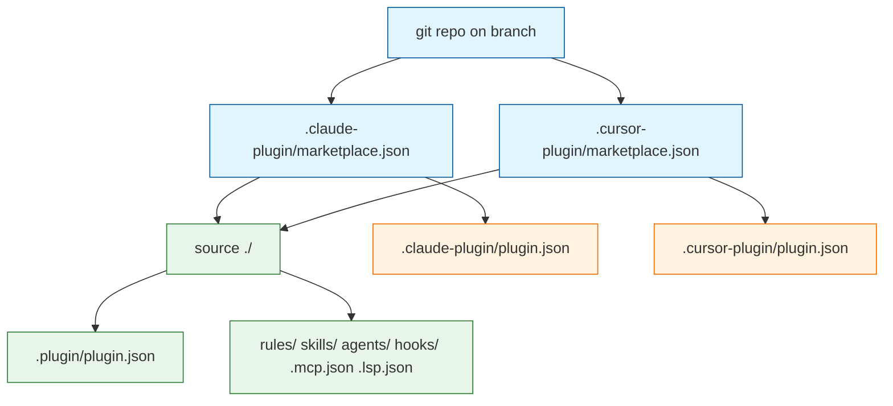

# Task: harness-marketplace-manifests

* Task ID: harness-marketplace-manifests
* Complexity: Level 2
* Type: simple enhancement

Add Claude Code and Cursor marketplace catalogs at repo root that list the existing open-plugins conformance plugin (this tree, not a new subdirectory). Operator will push and add the git branch as a marketplace; this task does not perform a live harness install.

Layout (plugin source is the marketplace root):

Pinned names: marketplace `open-plugins-surface-test`; plugin `open-plugins-conformance`; owner `Texarkanine`. Claude plugin `source` is `"./"`. Cursor plugin `source` is `"."` (Cursor entries are a directory path; keep the entry to `name`, `source`, `description` only). Thin vendor `plugin.json` files sit beside each marketplace file so default `strict: true` loaders have a harness-native manifest; they do not replace `.plugin/plugin.json`.

## Test Plan (TDD)

### Behaviors to Verify

- Claude catalog: load `.claude-plugin/marketplace.json` → JSON object with kebab-case `name` `open-plugins-surface-test`, `owner.name` present, `plugins` length 1, entry `name` `open-plugins-conformance`, `source` exactly `"./"`
- Cursor catalog: load `.cursor-plugin/marketplace.json` → same marketplace/plugin names; `source` is `"."`; each plugin entry keys ⊆ `{name, source, description}`
- Source resolution: resolved plugin directory is the repo root → contains `.plugin/plugin.json` whose `name` is `open-plugins-conformance` and existing component path fields still start with `./`
- Claude vendor manifest: `.claude-plugin/plugin.json` exists → `name` is `open-plugins-conformance`; directory contains `marketplace.json` and `plugin.json` only (no `skills/` nested under `.claude-plugin/`)
- Cursor vendor manifest: `.cursor-plugin/plugin.json` exists → `name` is `open-plugins-conformance`; same “manifests only” directory rule
- Probe tree unmoved: `rules/`, `skills/`, `agents/`, `hooks/hooks.json` still live at repo root (not copied under a `plugins/` subfolder)
- Edge — missing catalog: absent marketplace file → test fails (files must exist)
- Edge — Cursor extra fields: `keywords` / `category` / `tags` on a Cursor marketplace plugin entry → test fails (schema `additionalProperties` risk)
- Regression: existing `tests/test_plugin_skeleton.py` contracts still pass

### Test Infrastructure

- Framework: pytest (`uv run pytest`; configured in `pyproject.toml`)
- Test location: `tests/`
- Conventions: `test_*.py`; `ROOT = Path(__file__).resolve().parents[1]`; contract assertions on JSON/files; no new runner
- New test files: `tests/test_marketplace.py`
- Existing test files to extend: none (README marketplace-add copy is docs content — see Preflight finding, `.preflight-status`)

## Implementation Plan

### 1. Marketplace catalogs — executable

- Files: `tests/test_marketplace.py`, `.claude-plugin/marketplace.json`, `.claude-plugin/plugin.json`, `.cursor-plugin/marketplace.json`, `.cursor-plugin/plugin.json`

1. Stub tests: `tests/test_marketplace.py` with empty cases for Claude catalog shape, Cursor catalog shape, source resolution to repo root, vendor `plugin.json` names, `.claude-plugin/` / `.cursor-plugin/` contain only manifest JSON, probe dirs remain at repo root, Cursor entry key allowlist
2. Stub interface: create the four JSON files as empty objects `{}` (or `[]` where needed so paths exist)
3. Write tests and run red: `uv run pytest tests/test_marketplace.py` — assert names, `./` vs `.` sources, owner, plugin count, resolved path == `ROOT`, vendor manifests, no nested component dirs, Cursor keys allowlist
4. Write code and run green: fill Claude marketplace (`name`, `owner`, one plugin `source: "./"`); fill Cursor marketplace (`name`, `owner`, one plugin `source: "."`, entry keys only `name`/`source`/`description`); fill both vendor `plugin.json` with `name` `open-plugins-conformance`, `version` `0.1.0`, `description` matching `.plugin/plugin.json`; omit `version` on marketplace entries (avoid dual-pin); do not modify `.plugin/plugin.json` or probe surfaces

### 2. README marketplace install — docs content, no test steps required (Preflight finding: struck scheduled change-detector, see `.preflight-status`)

- Files: `README.md`

1. Stub interface: no new code surface — README already exists
2. Write code: extend README Install with git-marketplace add (repo `Texarkanine/open-plugins-surface-test`, plugin `open-plugins-conformance`, note that the operator chooses the branch/ref when adding the marketplace). Keep local-path language as an unverified alternative, not the documented success path. Do not add probe fingerprints or judgment wording. Re-run `tests/test_entrypoint_readme.py` and `tests/test_marketplace.py` as a regression check

## Technology Validation

No new technology - validation not required

## Dependencies

- Existing `.plugin/plugin.json` and repo-root probe tree (unchanged)
- Operator push + harness `marketplace add` with branch ref (out of band; not a build gate)
- pytest / `uv` already in repo

## Challenges & Mitigations

- Claude `marketplace.json` and `plugin.json` share `.claude-plugin/` when `source` is `"./"`: keep that directory to those two JSON files; components stay at repo root. Default `strict: true` with a thin vendor `plugin.json` so we do not set `strict: false` and duplicate component lists.
- Cursor marketplace plugin-entry schema may reject extra fields: allowlist `name`, `source`, `description` only (do not copy Claude-only fields onto the Cursor entry).
- Cursor `source` `.` vs `./`: pin `.` for Cursor (directory path) and `./` for Claude (docs require the prefix). If a later harness run rejects one, swap only that file — do not invent a `plugins/` subdirectory.
- Live install cannot be gated in pytest: contract tests cover file shape only; operator confirms after push.

## Pre-Mortem

- Manifests exist but Claude still cannot load because it never reads `.plugin/plugin.json`: already covered — add `.claude-plugin/plugin.json`. Same for Cursor.
- We pointed `source` at a GitHub object for this same repo, so a marketplace add cloned the catalog then tried to fetch the plugin again (or failed on a non-default branch): pin relative `./` / `.` so the cloned marketplace *is* the plugin.
- We “fixed” install by moving the plugin into `plugins/open-plugins-conformance/`, breaking probe paths and DESIGN layout: do not relocate surfaces; source is repo root.
- README still only documents local path install, so the operator has catalogs but no add recipe: Step 2.
- Tests pass while catalogs disagree on plugin `name`, so install commands differ per harness: pin `open-plugins-conformance` in both.

## QA Results

**FAIL** (see `memory-bank/active/.qa-validation-status`)

- Blocking — DRY/Integrity: plugin `name`/`version`/`description` are now triplicated across `.plugin/plugin.json`, `.claude-plugin/plugin.json`, and `.cursor-plugin/plugin.json` (description also in both marketplace entries) with only `name` asserted and `version`/`description` asserted nowhere. Add a lockstep contract test (test-first) so the vendor manifests cannot silently drift from the vendor-neutral manifest.
- Advisory: `test_source_resolves_to_repo_root_plugin` duplicates the `COMPONENT_PATH_FIELDS` `./`-prefix loop and name check already owned by `tests/test_plugin_skeleton.py`.
- Advisory: exact-set vendor-directory assertions will fire on any benign future file in `.claude-plugin/` / `.cursor-plugin/`.
- Clean: completeness, YAGNI (no marketplace-entry `version`, tight Cursor entry keys), regression (probe tree and `.plugin/plugin.json` untouched), integrity, README docs.

## Status

- [x] Initialization complete
- [x] Test planning complete (TDD)
- [x] Implementation plan complete
- [x] Technology validation complete
- [x] Pre-Mortem complete
- [x] Preflight
- [x] Build
- [x] QA (FAIL - Build must rerun)
