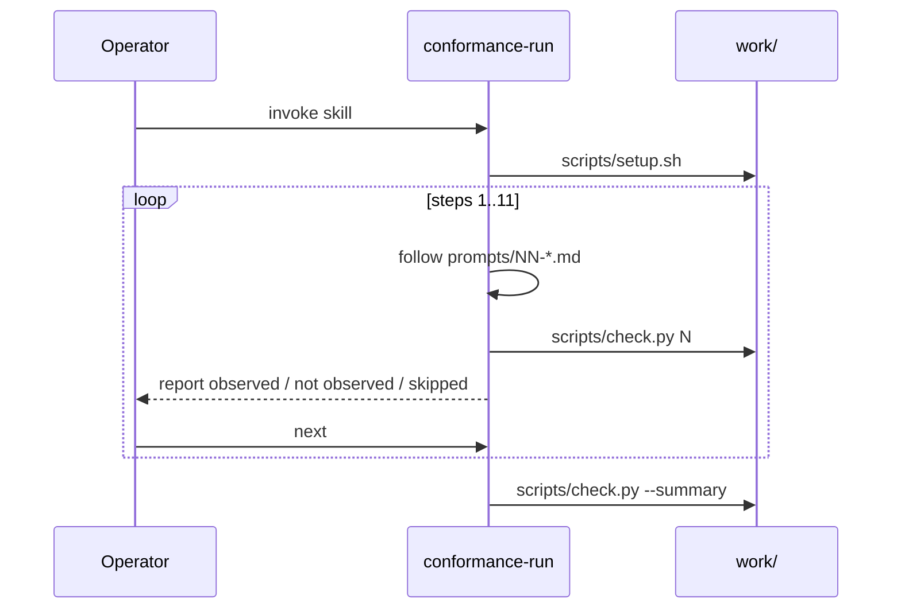

# Task: entrypoint-readme

* Task ID: entrypoint-readme
* Complexity: Level 3
* Type: feature

Deliver the attended-run driver and operator docs: `skills/conformance-run/SKILL.md` (setup → prompt/check loop → summary), a build-time sentinel-leakage lint over `prompts/` + the entrypoint skill, and a full README (install → launch → invoke, reading the capability table, single-step re-run). Close DESIGN implementation steps 12–13. Also finish the DESIGN pre-mortem gap: mark discretionary probes in `check.py --summary` so the table matches what the README teaches.

## Pinned Info

### Attended-run driver loop

Entrypoint skill owns the operator gate; leakage lint guards prompts + skill body only (probe components may contain sentinels).

## Component Analysis

### Affected Components
- **`skills/conformance-run/SKILL.md`** (new): operator-invoked driver; currently absent. Mirror `skills/build-stamp/` layout (`name` matches directory; YAML frontmatter + body). Must use `disable-model-invocation: true` so only the operator starts the loop.
- **`scripts/lint_leakage.py`** (new) + **`tests/test_leakage_lint.py`** (new): build-time sentinel scanner. DESIGN: fail if any probe sentinel appears in `prompts/` or the entrypoint skill. Pytest is the gate (`uv run pytest`); no CI config exists yet.
- **`README.md`**: replace stub with install → launch → invoke, capability-table reading (including discretionary), single-step re-run, headless footnote.
- **`scripts/check.py` `render_summary`**: DESIGN pre-mortem requires discretionary probes marked inline; today the table has no such mark. Steps 6 (description-only rule), 7 (skill), 8 (agent) are discretionary.
- **`DESIGN.md`**: implementation plan steps 12–13 become done (no open design choice; namespaced invocation remains a README concern per DESIGN Open Questions).

### Cross-Module Dependencies
- Entrypoint → `scripts/setup.sh`, `prompts/01–11-*.md`, `scripts/check.py` (by path under `$PLUGIN_ROOT`)
- Leakage lint → sentinel catalog shared with / derived from `scripts/check.py` constants (`SCOTS_FLAG`, `SEA_POEM_SENTINEL`, `BUILD_STAMP_TOKEN`, `LISTING_AUDITOR_TOKEN`, `MCP_CATS_TOKEN` / `MCP-OBSERVED` prefix) plus indent/marker strings not stored as constants (`7-space` / `5-space` style phrases, `lsp.launched`)
- Summary discretionary marks → `STEP_REGISTRY` metadata → `render_summary` row formatting
- README → documents harness-agnostic install (open-plugins `.agents/plugins/` + load-from-repo) and namespaced invoke `/open-plugins-conformance:conformance-run`; notes harness slash-command variants without inventing unverified vendor CLIs

### Boundary Changes
- New public operator surface: `conformance-run` skill + README procedures
- Summary table gains a discretionary indicator (column or inline marker) — observational wording preserved
- New pytest module is the leakage gate; no new packaged runtime dependency

### Invariants & Constraints
- Must preserve: no expectation leakage into prompts or entrypoint; observe-not-judge wording; setup never clears observations; one probe per prompt boundary
- Leakage lint scans **only** `prompts/` and `skills/conformance-run/` (not rules/skills probes/agents/check.py)
- Entrypoint must not name sentinel tokens, checker vocabulary that coaches compliance, or demanded indent widths
- README must not embed probe sentinel strings in examples
- Headless/batch remains a footnote, not a supported path
- TDD: planted-sentinel lint tests before lint implementation; skill/README structure + leakage tests before prose

## Open Questions

None - implementation approach is clear from DESIGN sequence diagram, pre-mortem leakage lint, existing skill layout, and open-plugins namespacing docs (https://open-plugins.com/agent-builders/components/skills).

## Test Plan (TDD)

### Behaviors to Verify

**Leakage lint**
- [Catalog covers probes]: scanner knows SCOTS flag, SEA-POEM / BUILD-STAMP / LISTING-AUDITOR tokens, `MCP-OBSERVED` prefix, indent phrases (`7-space`/`7 spaces`/`5-space`/`5 spaces` and digit-led variants used in existing prompt tests), `lsp.launched`
- [Clean tree]: current `prompts/` + (once present) entrypoint skill → lint passes (exit 0 / no findings)
- [Planted prompt leak]: temp/copied prompt containing a sentinel → lint fails naming file + sentinel
- [Planted skill leak]: entrypoint body containing a sentinel → lint fails
- [Out of scope ignored]: sentinel inside `rules/` or `skills/build-stamp/` does not fail the lint
- [CLI]: `python scripts/lint_leakage.py` non-zero on findings, zero when clean

**Summary discretionary marks**
- [Steps 6–8 marked]: `--summary` marks description-rule / skill / agent rows as discretionary
- [Other steps unmarked]: steps 1–5, 9–11 have no discretionary mark
- [Wording]: table still uses observed / not observed / skipped — never pass/fail

**Entrypoint skill**
- [Frontmatter]: `name: conformance-run` matches directory; description present; `disable-model-invocation: true`
- [Driver shape]: body orders setup.sh → steps 1–11 (read matching `prompts/NN-*.md`, follow, run `check.py N`, report observation, wait for operator "next") → `check.py --summary`
- [Observational wording]: uses observed / not observed / skipped; no pass/fail / unsupported judgment
- [No leakage]: skill body fails the same **sentinel catalog** as prompts (tokens, flag, indent width phrases, `lsp.launched`)
- [No checker coaching]: forbid `fingerprint`, `sentinel`, `pass`/`fail` as judgment, `unsupported` — **do not** forbid `observed` / `not observed` / `skipped` (required reporting vocabulary; prompts forbid those words, the driver must use them)

**README**
- [Sections]: install, launch, invoke (namespaced skill), how to read capability table (incl. discretionary + SessionEnd note), single-step re-run, headless footnote
- [Self-checks]: documents `uv run pytest` (includes leakage lint)
- [No sentinel leakage]: README text does not contain probe sentinel catalog strings
- [Replaces stub]: no longer defers to DESIGN-only for operator instructions

**DESIGN close-out**
- [Steps 12–13 delivered]: `DESIGN.md` Implementation Plan no longer presents entrypoint skill / README as future work ("Written last" / deferred)

### Test Infrastructure

- Framework: pytest via `uv run pytest` (`pyproject.toml`)
- Test location: `tests/`
- Conventions: flat `test_<area>.py`, function tests, `ROOT` path constants; CLI via subprocess where needed
- New test files: `tests/test_leakage_lint.py`, `tests/test_entrypoint_readme.py` (skill + README + discretionary summary; or split if clearer)
- Existing files to extend: `tests/test_check.py` (summary discretionary rows) if summary tests already live there

### Integration Tests

- Full suite remains green after skill/README/lint land (leakage lint runs as part of pytest)
- Optional smoke: invoke lint script as subprocess from tests (CLI contract)

## Implementation Plan

1. [x] **Leakage lint tests (failing)** → `tests/test_leakage_lint.py`
    - Files: `tests/test_leakage_lint.py`
    - Changes: catalog, clean-tree, planted-leak (tmp_path), out-of-scope ignore, CLI exit codes
2. [x] **Implement leakage lint** → `scripts/lint_leakage.py`
    - Files: `scripts/lint_leakage.py`
    - Changes: scan `prompts/**/*.md` + `skills/conformance-run/**`; import/reuse check.py constants where possible; exit non-zero with file:line findings
3. **Discretionary summary tests (failing)** → `tests/test_check.py`
    - Files: `tests/test_check.py` + fixtures with sample JSONL for steps 6–8 vs others
    - Changes: assert discretionary marker present/absent per DESIGN; keep existing status-emoji contracts green
4. **Implement discretionary summary marks** → `scripts/check.py`
    - Files: `scripts/check.py`
    - Changes: `discretionary: true` on registry entries 6–8 (extend `_entry`); `render_summary` emits marker (e.g. `*` / `(discretionary)` column)
5. **Entrypoint skill structure + leakage tests (failing)** → `tests/test_entrypoint_readme.py`
    - Files: `tests/test_entrypoint_readme.py`
    - Changes: frontmatter, driver shape, observational wording, sentinel catalog + skill-safe coaching checks (see Behaviors)
6. **Implement entrypoint skill** → `skills/conformance-run/SKILL.md`
    - Files: `skills/conformance-run/SKILL.md`
    - Changes: full driver instructions; no sentinels; paths relative to plugin root / `$PLUGIN_ROOT`
7. **README structure + leakage tests (failing)** → `tests/test_entrypoint_readme.py`
    - Files: `tests/test_entrypoint_readme.py`
    - Changes: required section/heading assertions; sentinel catalog absence
8. **Implement README** → `README.md`
    - Files: `README.md`
    - Changes: install (clone/load plugin per open-plugins; `.agents/plugins/` note), launch in empty worktree, invoke `/open-plugins-conformance:conformance-run` (+ harness namespace variants), reading table (status emojis, discretionary, SessionEnd), re-run one step (`setup.sh` idempotent; `check.py N`), `uv run pytest`, headless footnote
9. **DESIGN close-out tests (failing)** → `tests/test_entrypoint_readme.py`
    - Files: `tests/test_entrypoint_readme.py`
    - Changes: assert Implementation Plan treats entrypoint + README as delivered (not future/deferred)
10. **Close DESIGN implementation steps 12–13** → `DESIGN.md`
    - Files: `DESIGN.md`
    - Changes: mark items 12–13 delivered (light touch; no rewrite)
11. **Full suite** → `uv run pytest`

## Technology Validation

No new technology - validation not required. Lint is stdlib Python; skill/README are markdown; pytest already present.

## Challenges & Mitigations

- **Indent "sentinels" are phrases, not check.py constants:** Encode the same leak patterns already used in `tests/test_r2_r3_indent.py` into the lint catalog so prompts cannot regress.
- **False positives in skill (step numbers, "7" in "steps 1–11"):** Match phrase forms (`7-space`, `7 spaces`, etc.), not bare digit `7`.
- **README mentioning observation files:** Document `work/observations/run.jsonl` and status labels without quoting probe tokens or `lsp.launched` as an instruction to the agent.
- **Per-harness install recipes unknown:** Stick to open-plugins vendor-neutral install + namespaced skill name; do not invent Cursor/Claude CLI flags.
- **Discretionary mark vs existing summary tests:** Extend tests that snapshot/parse summary output; keep emoji status contract intact.
- **techContext "skip prompts/prose" preference:** Milestone explicitly requires leakage + structural README/skill tests; prefer contract assertions over prose snapshots.
- **Skill must say `observed` but prompt leak patterns forbid it:** Skill anti-coaching checks are a distinct allowlist from prompt leak patterns (see Behaviors).

## Preflight Amendments

- Split DESIGN close-out into explicit test-before-code pair (steps 9–10).
- Pinned discretionary summary tests to `tests/test_check.py`.
- Clarified skill vocabulary: sentinel catalog + skill-safe coaching checks; `observed`/`not observed`/`skipped` allowed in the driver.

## Pre-Mortem

- **Lint catalog drifts from real probes → false confidence:** Mitigate by importing string constants from `check.py` for token probes; add a test that each catalog token still appears in its owning component file.
- **Entrypoint accidentally coaches the agent with checker details → suite measures instruction-following:** Already covered by Challenges (leakage + coaching vocabulary); skill body stays procedural (which prompt file, which check command).
- **README overclaims harness install support → operators fail before step 1:** Already covered by Challenges (vendor-neutral only).
- **Ship without discretionary marks → operators misread soft `not observed`:** In plan steps 3–4; do not defer again.

## Status

- [x] Component analysis complete
- [x] Open questions resolved
- [x] Test planning complete (TDD)
- [x] Implementation plan complete
- [x] Technology validation complete
- [x] Pre-Mortem complete
- [x] Preflight
- [ ] Build
- [ ] QA
