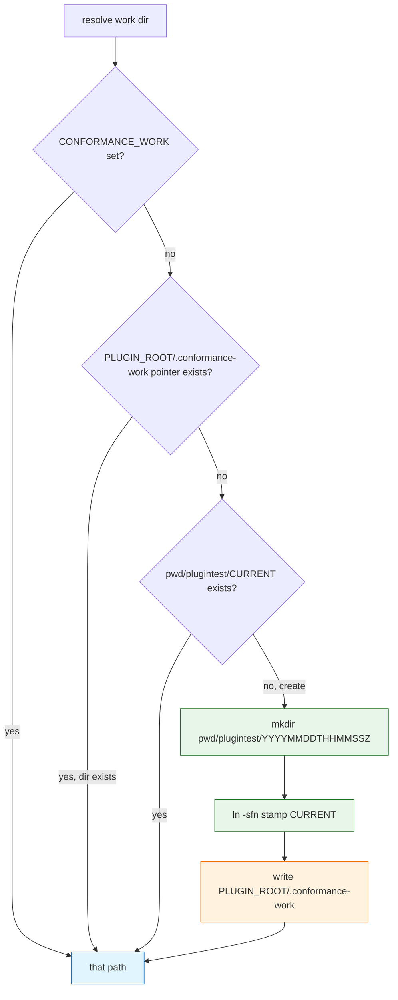

# Task: plugintest-cwd-work

* Task ID: plugintest-cwd-work
* Complexity: Level 2
* Type: simple enhancement

Default the conformance run directory to `$PWD/plugintest/<UTC-datestamp>/` with `plugintest/CURRENT` as the shared pointer. Stop using `$PLUGIN_ROOT/work` as the run. Keep `CONFORMANCE_WORK`. Preserve setup's reset boundary.

Pointer file is install-tree metadata only (absolute path to the cwd run). Run contents stay under `pwd/plugintest/`. LSP reads the pointer when its process cwd is not the workspace.

## Test Plan (TDD)

### Behaviors to Verify

- Override: `CONFORMANCE_WORK=/abs/work` → resolver returns that path and does not create `plugintest/`
- Create: unset override, empty cwd → creates `plugintest/<UTC-stamp>/` (`YYYYMMDDTHHMMSSZ`), `plugintest/CURRENT` is a symlink to that stamp (relative target), writes `$PLUGIN_ROOT/.conformance-work` containing the absolute work path
- Reuse: second resolve in same cwd with CURRENT already set → same directory; no second stamp
- Pointer: CONFORMANCE_WORK unset, cwd elsewhere, pointer file names an existing dir → that dir (LSP-without-workspace-cwd)
- Setup reset: `setup.sh` without CONFORMANCE_WORK uses resolver; wipes artifacts, regenerates fixtures, does not delete existing `observations/hooks.jsonl` under CURRENT
- hook_record: without CONFORMANCE_WORK, appends to `$PWD/plugintest/CURRENT/observations/hooks.jsonl`
- check.py `resolve_work_dir`: same resolver (override / CURRENT / create)
- LSP `resolve_work_root`: honors CONFORMANCE_WORK; without it uses pointer or cwd CURRENT, not `$PLUGIN_ROOT/work`
- gitignore: `plugintest/` is ignored; drop the `work/` requirement (or keep `work/` as well for leftover local dirs — keep both)
- Prompts/entrypoint: no instruction that artifact paths are relative to plugin root; paths used for writes are `plugintest/CURRENT/artifacts/` (and fixtures under `plugintest/CURRENT/fixtures/`)
- Edge: CONFORMANCE_WORK set to a relative path still used as given (existing callers pass absolute tmp paths)
- Regression: existing CONFORMANCE_WORK pytest contracts still pass; reset boundary tests still pass

### Test Infrastructure

- Framework: pytest (`uv run pytest`)
- Test location: `tests/`
- Conventions: `ROOT = Path(__file__).resolve().parents[1]`; tmp_path + env; subprocess for shell scripts
- New test files: `tests/test_work_root.py`
- Existing tests to modify: `tests/test_plugin_skeleton.py` (gitignore), `tests/test_l1_lsp.py` (default resolve), `tests/test_setup.py` (optional cwd-default case), `tests/test_h1_hooks.py` if it asserts plugin-work default
- Existing test files to extend: none for prompt wording (Unit 3 is prose/policy; Preflight struck scheduled change-detectors)

## Implementation Plan

### 1. Work-root resolver — executable

- Files: `scripts/work_root.py`, `tests/test_work_root.py`

1. Stub tests: empty cases for override, create+CURRENT+pointer, reuse CURRENT, pointer-when-cwd-differs
2. Stub interface: `scripts/work_root.py` with `resolve_work_dir(*, create: bool, cwd: Path, plugin_root: Path, env: Mapping) -> Path` and `if __name__` CLI: subcommand `ensure` always means `create=True` and prints the path (required so `hook_record.sh` can create the run dir at SessionStart before setup)
3. Write tests and run red: `uv run pytest tests/test_work_root.py`
4. Write code and run green: UTC stamp `YYYYMMDDTHHMMSSZ`; relative CURRENT symlink; pointer file `plugin_root / ".conformance-work"` (single line absolute path); `CONFORMANCE_WORK` first; never mkdir under `plugin_root / "work"`

### 2. Wire callers — executable

- Files: `scripts/setup.sh`, `scripts/hook_record.sh`, `scripts/check.py`, `servers/probe_lsp.py`, `tests/test_l1_lsp.py`, `tests/test_setup.py`, `tests/test_h1_hooks.py`

1. Stub tests: replace `test_resolve_work_root_defaults_to_plugin_work` with default-is-cwd-plugintest / pointer; add setup-without-CONFORMANCE_WORK in a tmp cwd; hook_record without override writes under CURRENT
2. Stub interface: callers still have old bodies until step 4
3. Write tests and run red
4. Write code and run green: bash `WORK_DIR="$(python3 "$PLUGIN_ROOT/scripts/work_root.py" ensure)"` (process cwd is the workspace). `check.py` inserts `str(Path(__file__).resolve().parent)` onto `sys.path` before `import work_root` — required because tests load `check.py` via `importlib.util.spec_from_file_location` + `exec_module`, which does not add the script directory to `sys.path`. `probe_lsp.py` likewise inserts `scripts/` onto `sys.path` and calls the same function with `create=True` on initialize. Setup still wipes artifacts/fixtures only. `.conformance-work` is not git-tracked (lives in the install tree at runtime; gitignore it so a clone cannot commit a pointer).

### 3. Workspace-relative probe paths — prose/policy

- Files: `prompts/*.md`, `skills/conformance-run/SKILL.md`, `skills/build-stamp/SKILL.md`, `agents/listing-auditor.md`
- No tests: operator-facing prose (prompts/skill wording); the previously scheduled grep-phrase assertions were struck at Preflight as change-detectors (fires only on deliberate wording edits, silent on an actually-broken resolver) — see Preflight findings

1. Stub interface: files already exist
2. Write code: replace `work/artifacts` / `work/fixtures` / `work/observations` in those operator-facing files with `plugintest/CURRENT/...`. Entrypoint skill: run `bash "$PLUGIN_ROOT/scripts/setup.sh"` (or the harness equivalent) **from the launch workspace cwd**, not after `cd` to the plugin cache. Leakage lint must still pass (no sentinel leaks).

### 4. gitignore — executable

- Files: `.gitignore`, `tests/test_plugin_skeleton.py`

1. Stub tests: require `plugintest/` in gitignore
2. Stub interface: `.gitignore` exists
3. Write tests and run red
4. Write code and run green: ignore `plugintest/` and `.conformance-work`; keep `work/` ignore for leftover local dirs

### 5. Docs — prose/policy

- Files: `README.md`, `DESIGN.md`, `memory-bank/techContext.md`
- No tests: prose/policy artifact

1. README Launch: scratch is `$PWD/plugintest/<stamp>/` via CURRENT; do not delete CURRENT between SessionStart and setup
2. DESIGN layout: `plugintest/` under launch cwd, not plugin `work/`
3. techContext: default work root is cwd `plugintest/`, CONFORMANCE_WORK override, pointer for LSP

## Technology Validation

No new technology - validation not required

## Dependencies

- Existing `CONFORMANCE_WORK` pytest seam
- SessionStart still depends on harness expanding `${PLUGIN_ROOT}` in hook commands (out of scope)
- Operator launch cwd is the workspace root the harness sandboxes

## Challenges & Mitigations

- LSP cwd ≠ workspace: write `$PLUGIN_ROOT/.conformance-work` from the first `ensure` (hook or setup) so initialize can find the run without `pwd`
- Setup vs SessionStart order: `ensure` is idempotent on CURRENT; setup must not recreate a second stamp if CURRENT exists
- Agent still writes to cache if skill says plugin root: Step 3 rewrites those paths
- Relative CURRENT target (`YYYYMMDDTHHMMSSZ`) so the symlink does not embed an absolute pwd that breaks if the workspace is moved within the session (it will not be)

## Pre-Mortem

- Checkers look at cwd CURRENT while Haiku still writes to plugin cache because the skill still says plugin root: Step 3; if we skip it the Haiku cheat/cache run repeats
- SessionStart creates a stamp then setup creates another because bash cwd is plugin root not workspace: `ensure` must use process cwd; README/skill tell the operator to run setup from the launch workspace (not `cd` to the cache). Skill currently says "from the plugin root" — that must change to launch cwd with plugin scripts addressed via `$PLUGIN_ROOT` or an absolute cache path the harness already used
- Two Python copies of resolve drift: one module `scripts/work_root.py` only
- Tests all pass via CONFORMANCE_WORK while default cwd path is wrong: Step 1–2 include unset-override cases

## Status

- [x] Initialization complete
- [x] Test planning complete (TDD)
- [x] Implementation plan complete
- [x] Technology validation complete
- [x] Pre-Mortem complete
- [ ] Preflight
- [ ] Build
- [ ] QA
