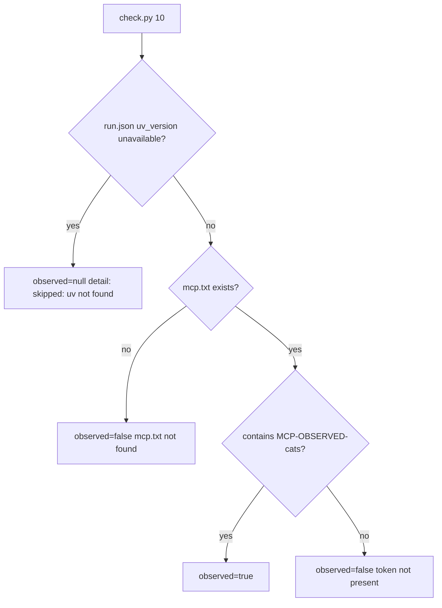

# Task: m1-mcp-probe

* Task ID: m1-mcp-probe
* Complexity: Level 3
* Type: feature

Deliver M1 MCP probe: PEP 723 `servers/probe_mcp.py` exposing `probe_hello(name) -> "MCP-OBSERVED-<name>"`, `.mcp.json` launching it via `uv run --script` with `${PLUGIN_ROOT}`, prompt 10 (call tool with `name="cats"`, save result to `mcp.txt`), step-10 observer that skips when setup recorded `uv` unavailable, and observes token presence in `work/artifacts/mcp.txt` otherwise.

## Pinned Info

### M1 observe path

Skip is driven by setup's `run.json` `uv_version` (already written today as `"unavailable"` when `uv` is absent). Step 10 never treats missing `uv` as a false negative.

## Component Analysis

### Affected Components

- **`scripts/check.py`**: Steps 1–9 have real observers; step 10 is still `observe_stub`. → Add shared `uv_unavailable(work)` (or equivalent reading `run.json`), `observe_m1_mcp`, bind `STEP_REGISTRY[10]`, update module docstring. Reuse `artifact_contains` (already used by S1/A1). Expected fingerprint for prompt's `name="cats"`: `MCP-OBSERVED-cats`.
- **`servers/probe_mcp.py`** (new): None today. → PEP 723 inline-script MCP server (`dependencies = ["mcp"]`), FastMCP stdio, tool `probe_hello(name) -> f"MCP-OBSERVED-{name}"`. Pure return formatting must be unit-testable without a full MCP session.
- **`.mcp.json`** (new): Manifest already points at `./.mcp.json`; file missing. → `mcpServers` entry: `command`/`args` launch `uv run --script ${PLUGIN_ROOT}/servers/probe_mcp.py` (open-plugin-spec shape; `${PLUGIN_ROOT}` in args).
- **`prompts/10-*.md`** (new): None. → Prompt 10: call `probe_hello` with `name="cats"`, save tool return under `work/artifacts/mcp.txt`. No fingerprint string, no `check.py`, no observational judgment language.
- **`scripts/setup.sh`**: Already records `uv_version` (`unavailable` when absent). → No behavioral change required for M1; skip path consumes existing header field.
- **`.plugin/plugin.json` / `DESIGN.md` / README**: Manifest already declares `mcpServers`; DESIGN already specifies M1. → No doc/manifest edits in this milestone.

### Invariants & Constraints

- Must preserve observe-not-judge: missing token → `observed=false` exit 0; uv absent → `observed=null` skip exit 0; infra errors only for missing work/`run.json`/IO.
- Must preserve no expectation leakage: `MCP-OBSERVED-*` only in server (and check.py observer constants); never in prompt.
- Must preserve setup never clearing `work/observations/`.
- Must hold DESIGN skip wording: detail exactly `skipped: uv not found` (or prefix-compatible; prefer exact DESIGN string).
- Must use `${PLUGIN_ROOT}` (not vendor-specific roots) in `.mcp.json`.
- Must not invent LSP deliverables in this milestone (step 11 stays stub).
- Shared `uv_unavailable` helper is allowed so LSP can reuse later — keep it tiny.

### Cross-Module Dependencies

- Harness → `.mcp.json` → `uv run --script` → `servers/probe_mcp.py` → tool `probe_hello`
- Operator prompt 10 → agent calls tool → writes `work/artifacts/mcp.txt`
- `check.py 10` → reads `run.json` (skip gate) + `mcp.txt` → appends step-10 row to `run.jsonl`
- Setup → `run.json.uv_version` → skip gate (no new setup code)

### Boundary Changes

- **Step 10 observer contract (new):**
  - Read `uv_version` with the same default as `render_summary`: missing key → `"unavailable"`. If value is `"unavailable"` → `observed=null`, `detail="skipped: uv not found"`
  - Else if `work/artifacts/mcp.txt` missing → `observed=false`, detail names `mcp.txt`
  - Else if file contains `MCP-OBSERVED-cats` → `observed=true`
  - Else → `observed=false`, token-not-present detail
  - Exit 0 for all of the above when work/`run.json` valid
  - Malformed `run.json` during observe: prefer letting existing `observe_step`/`ensure_run_id` infra paths handle JSON errors; helper/observer should not invent a second JSON-error exit semantics
- **`.mcp.json` contract:** top-level `mcpServers` object; at least one server; launch via `uv` + `run` + `--script` + path containing `${PLUGIN_ROOT}/servers/probe_mcp.py`
- **Server contract:** PEP 723 script metadata; tool name `probe_hello`; return `MCP-OBSERVED-<name>`

## Open Questions

None — implementation approach is clear from DESIGN.md (tool return, mcp.txt, uv skip detail), open-plugin-spec `.mcp.json` + `${PLUGIN_ROOT}`, established S1/A1 token observer pattern, and a plan-phase PoC confirming `from mcp.server.fastmcp import FastMCP` works under `uv run --with mcp`.

## Test Plan (TDD)

### Behaviors to Verify

- `uv_unavailable(work)` → True when `uv_version` is `"unavailable"` or the key is missing (summary-compatible default); False for a real version string
- Skip path: `uv_version=unavailable` (or missing) → `observed=null`, detail `skipped: uv not found`, CLI prints `skipped`, exit 0
- Missing `mcp.txt` (uv present) → not observed; detail mentions file
- `mcp.txt` without token → not observed
- `mcp.txt` containing `MCP-OBSERVED-cats` → observed
- Wrong name token only (`MCP-OBSERVED-dogs`) → not observed (prompt demands cats)
- CLI step 10 → JSONL fields `mcp` / `server` / `m1-probe-mcp` / `create`; exit 0; no judgment language in detail
- Summary already renders `⊘ skipped` for `observed=null` (existing `test_check.py`); do not regress
- `probe_hello("cats")` (or extracted formatter) → `"MCP-OBSERVED-cats"`
- `servers/probe_mcp.py` has PEP 723 `# /// script` block declaring `mcp` dependency
- `.mcp.json` → `mcpServers` entry uses `uv` / `run` / `--script` / `${PLUGIN_ROOT}/servers/probe_mcp.py`
- Prompt 10 → instructs call `probe_hello` with cats + save to `mcp.txt`; no `MCP-OBSERVED`, no `check.py`, no `\bobserved\b` / sentinel/fingerprint leak patterns used by prior suites

### Test Infrastructure

- Framework: pytest via `uv run pytest` (`pyproject.toml`)
- Test location: `tests/`
- Conventions: `importlib` load of `scripts/check.py`; `CONFORMANCE_WORK` + `tmp_path`; helpers → observers → CLI → components → leakage (see `tests/test_r4_s1_a1.py`)
- New test files: `tests/test_m1_mcp.py`
- Server unit smoke: import/call pure return helper (or import module and call tool function) without starting a stdio session

### Integration Tests

- CLI step 10 with planted `mcp.txt` + normal `uv_version` → observed JSONL row
- CLI step 10 with `uv_version=unavailable` → skipped JSONL row even if `mcp.txt` planted (skip wins)

## Implementation Plan

1. [x] **uv skip helper (TDD)**
    - Files: `tests/test_m1_mcp.py`, `scripts/check.py`
    - Changes: `uv_unavailable(work: Path) -> bool` reading `work/run.json` (`uv_version == "unavailable"`); missing/malformed handled as not-unavailable for the helper itself only if observe_step already infra-fails on bad run.json — prefer reading inside observer after observe_step validated the file exists (observer may assume run.json present, or re-read safely)

2. [x] **`observe_m1_mcp` + registry bind (TDD)**
    - Files: `tests/test_m1_mcp.py`, `scripts/check.py`
    - Changes: implement observer per Boundary Changes; constant `MCP_CATS_TOKEN = "MCP-OBSERVED-cats"`; `STEP_REGISTRY[10]` `observe=observe_m1_mcp`; update module docstring (steps 1–10 real; 11 stub)

3. [ ] **CLI step 10 smoke (TDD)**
    - Files: `tests/test_m1_mcp.py`
    - Changes: observed / not-observed / skipped / exit-0 / metadata / skip-wins-over-artifact tests

4. [ ] **Server return format + PEP 723 file (TDD)**
    - Files: `tests/test_m1_mcp.py`, `servers/probe_mcp.py`
    - Changes: FastMCP server; `probe_hello`; PEP 723 header with `mcp`; `mcp.run()` stdio default under `__main__`. Structure so the return string is unit-testable (decorate a named function).

5. [ ] **`.mcp.json` (TDD)**
    - Files: `tests/test_m1_mcp.py`, `.mcp.json`
    - Changes: single `mcpServers` entry as above; assert `${PLUGIN_ROOT}` present; assert script path

6. [ ] **Prompt 10 (TDD)**
    - Files: `tests/test_m1_mcp.py`, `prompts/10-m1-mcp.md` (name may vary; keep `10-` prefix)
    - Changes: call `probe_hello(name="cats")`, save to `work/artifacts/mcp.txt`; leakage assertions

7. [ ] **Full suite verification**
    - Files: none new
    - Changes: `uv run pytest` entire suite green; confirm existing skip/summary cases still pass

## Technology Validation

- **New runtime dependency (server-only):** Python package `mcp` via PEP 723 inline metadata (not added to repo `pyproject.toml`).
- **PoC (plan phase):** `uv run --with mcp python -c 'from mcp.server.fastmcp import FastMCP; …'` succeeded — FastMCP tool decorator returns expected `MCP-OBSERVED-cats` string.
- Docs: [Model Context Protocol Python SDK](https://github.com/modelcontextprotocol/python-sdk), [open-plugins MCP servers](https://open-plugins.com/agent-builders/components/mcp-servers).

## Challenges & Mitigations

- **SDK API churn (FastMCP vs MCPServer):** PoC locked FastMCP import path that works with current `mcp` on this machine; pin `mcp` loosely in PEP 723 (`"mcp"`) unless build hits breakage — then pin a known-good version.
- **Skip vs false negative:** Gate only on setup's `uv_version == "unavailable"`; do not live-probe `PATH` in check (session consistency with run header). Challenge already matches DESIGN.
- **Fingerprint leakage in prompt:** Prompt names the tool and argument but never the return string; leakage tests ban `MCP-OBSERVED`.
- **`mcp.txt` with extra prose:** Use `artifact_contains` (substring) so agent wrappers that paste the tool return into a short note still observe — matches S1/A1 style and DESIGN "carries tool return".
- **Step 11 untouched:** Leave LSP stub; shared helper only.

## Pre-Mortem

- **Plan treated missing uv as not-observed:** Would poison capability reports. → Boundary Changes require `observed=null` + DESIGN detail; Challenge 2.
- **Prompt included `MCP-OBSERVED-cats`:** Expectation leakage / agent coaching. → Leakage tests + prompt prose omit the return.
- **`.mcp.json` used `${CLAUDE_PLUGIN_ROOT}`:** Vendor lock-in vs DESIGN/H1 precedent. → Tests assert `${PLUGIN_ROOT}`.
- **Server deps put in repo pyproject:** Couples harness tests to MCP SDK unnecessarily. → PEP 723 only on the server script (tech validation).
- **Skip checked after artifact:** Agent could plant a fake mcp.txt without uv/tools. → Skip gate runs first (pinned flowchart).

## Status

- [x] Component analysis complete
- [x] Open questions resolved
- [x] Test planning complete (TDD)
- [x] Implementation plan complete
- [x] Technology validation complete
- [x] Pre-Mortem complete
- [x] Preflight
- [ ] Build
- [ ] QA

## Preflight Amendments

- Skip gate uses `header.get("uv_version", "unavailable") == "unavailable"` so missing key matches `render_summary`'s default (not only setup's explicit write).
