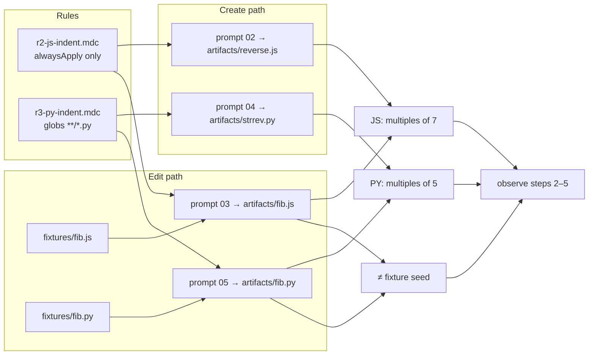

# Task: r2-r3-indent

* Task ID: r2-r3-indent
* Complexity: Level 3
* Type: feature

Deliver R2/R3 indent probes end-to-end: `rules/r2-js-indent.mdc` (**alwaysApply only** — no globs), `rules/r3-py-indent.mdc` (globs only), prompts 02–05, shared indent fingerprint checker, and edit-path file-modified recording for steps 2–5 — TDD: shared indent + modified-file checker tests before rules, fixtures assumptions, and prompts.

## Pinned Info

### Probe → artifact → check flow

Pinned because create vs edit share one indent predicate but diverge on file-modified and artifact paths; the diagram keeps that boundary visible during build.

### Invariants for this sub-run

1. No expectation leakage: indent-width demands live only in the two rule files — never in prompts 02–05 or fixture comments.
2. **Distinct indent bases by language (intentional).** Shared checker is parameterized (`multiples of N`): R2/JS → **N=7**, R3/Python → **N=5**. Mermaid ART2/ART3 are authoritative; probe-matrix rows that still say 7 for Python are stale and must be corrected in DESIGN during build. Different N keeps JS vs PY fingerprints from being interchangeable and keeps create/edit probes from sharing one accidental-compliance story.
3. Create vs edit split: edit observations require indent fingerprint **and** content differing from the seeded fixture; detail reports both dimensions so a no-op turn is visible.
4. Checks observe; missing artifacts / non-compliant indent → `observed: false`, exit 0.
5. Fixtures remain setup-owned 4-space recursive seeds; this milestone does not change `setup.sh` unless a contract gap appears (expected: none — fixtures already land).
6. One probe per prompt boundary; JS vs PY extensions prevent cross-credit.
7. **One frontmatter mode per rule.** `alwaysApply` and `globs` are not combined — `alwaysApply+globs` is not a real mode (alwaysApply subsumes). R2 is `alwaysApply: true` with **no** `globs:` key; JS targeting lives in the rule body. R3 is globs-only with **no** `alwaysApply: true`. Registry/JSONL `mode` for steps 2–3 is `alwaysApply` (not `alwaysApply+globs`).

## Component Analysis

### Affected Components

- **`scripts/check.py`**: today steps 2–5 use `observe_stub` and incorrectly label mode `alwaysApply+globs`. Add pure indent helpers, file-modified helper, create/edit observers, wire `STEP_REGISTRY[2–5]`, **and correct mode to `alwaysApply` for steps 2–3**.
- **`rules/r2-js-indent.mdc`** (new): `alwaysApply: true` only — **no globs**; body demands **7-space** (multiple) indentation when writing/editing JS.
- **`rules/r3-py-indent.mdc`** (new): globs `**/*.py`, no alwaysApply; body demands **5-space** (multiple) indentation for Python.
- **`prompts/02-r2-js-create.md` … `05-r3-py-edit.md`** (new): provoke create/edit without naming indent widths, "7", "5", or "spaces" as a style demand.
- **`tests/`**: new `tests/test_r2_r3_indent.py`; update `tests/test_check.py` wherever it plants `mode: "alwaysApply+globs"`.
- **`scripts/setup.sh` / fixtures**: already seed `fib.js` / `fib.py` at 4-space recursive — **no change expected** (4 is neither a 7- nor 5-compliant story for accidental edit-path credit).
- **`DESIGN.md`**: correct R2 labeling from `alwaysApply + globs` / `alwaysApply+globs` to alwaysApply-only; align probe-matrix Observation for steps 4–5 to **5-space multiples** (mermaid already has 7 vs 5).

### Cross-Module Dependencies

- Rules → prompts: prompts must not restate rule demands; prompts name artifact paths only.
- Fixtures → edit observers: `file_modified` compares `work/artifacts/fib.{js,py}` to `work/fixtures/fib.{js,py}` (byte/text inequality after normalize newlines as needed).
- Shared indent helpers → all four step observers.
- `STEP_REGISTRY` steps 2–5: wire observers **and** fix mode string for 2–3 (`alwaysApply+globs` → `alwaysApply`).

### Boundary Changes

- Public CLI of `check.py` unchanged (`<step>` / `--summary`).
- Observation JSONL schema unchanged; `mode` value for steps 2–3 becomes `alwaysApply` (breaking vs the stub label / DESIGN sample — intentional correction).
- `detail` vocabulary expands to include indent widths and, on edit steps, `file_modified: true|false`.
- New rule/prompt files are additive plugin surface.

## Open Questions

None - operator corrected false `alwaysApply+globs` mode; approach otherwise clear from DESIGN Challenges, R1 pattern, and setup fixtures.

## Test Plan (TDD)

### Behaviors to Verify

- Indent widths: leading-space widths on non-blank lines → set/list of widths; blank lines ignored; no indented lines → empty widths (treat as not observed for fingerprint — nothing to credit).
- Multiples-of-N: parameterized predicate — JS observers use N=7, Python use N=5; tabs / non-space leading whitespace → fail fingerprint.
- Cross-N negative: a file with only 7-space indents is **not** observed for Python (N=5); a file with only 5-space indents is **not** observed for JS (N=7).
- Create observe (JS/PY): missing artifact → `observed: false`, detail names file; non-compliant indent → false + `indent widths seen: [...]`; compliant for that step's N → true + widths detail.
- Edit observe: missing artifact → false; artifact equals fixture → `file_modified: false` and `observed: false` even if indent somehow compliant; artifact differs + non-compliant indent → false with both dimensions in detail; differs + compliant for N → `observed: true`.
- Registry/CLI: `check.py 2` (and at least one edit step) appends JSONL with `mode: "alwaysApply"`, correct probe/path, exits 0 on not observed.
- Rule R2: frontmatter `alwaysApply: true`; **`globs:` absent**; body demands **7-space** indentation for JS; no Scottish-flag / other probe leakage.
- Rule R3: globs `**/*.py`, no `alwaysApply: true`; body demands **5-space** indentation for Python.
- Prompts 02–05: name correct artifact (and fixture source on edit); no leakage of `7`, `5`, indent-width demands, or "spaces" as style instruction; no checker/sentinel spoilers.
- Cross-extension: JS observer ignores Python artifacts and vice versa (path selection only).
- Harness/docs cleanup: no remaining `alwaysApply+globs` in `check.py`, `tests/test_check.py`, or `DESIGN.md` for R2; matrix steps 4–5 say 5-space multiples.

### Test Infrastructure

- Framework: pytest via `uv run pytest` (`pyproject.toml`)
- Test location: `tests/`
- Conventions: load `check.py` via `importlib` (see `tests/test_r1_scots.py`); `CONFORMANCE_WORK` tmp workdirs; observational wording bans from `tests/test_check.py`
- New test files: `tests/test_r2_r3_indent.py`
- Update: `tests/test_check.py` summary fixture mode string

### Integration Tests

- CLI step 2 with compliant `reverse.js` → stdout `observed`, JSONL `observed: true`, `mode: "alwaysApply"`, detail includes widths
- CLI step 3 with modified compliant `fib.js` → observed; with unmodified copy of fixture → not observed + `file_modified: false` in detail

## Implementation Plan

1. **Pure indent helpers (TDD)**
    - Files: `tests/test_r2_r3_indent.py`, `scripts/check.py`
    - Changes: add failing tests for indent-width extraction + **parameterized** multiples-of-N predicate (cover N=7 and N=5); implement helpers whose **leading-space algorithm matches** `tests/test_setup.py::_indent_widths` (skip blank lines; count leading ASCII spaces only; leading tab → non-compliant marker, not a positive width). Cover empty, 4-space, 7/14, 5/10, mixed, tabs, and cross-N negatives. Detail format pinned to DESIGN: `indent widths seen: […]` with sorted unique positive widths.

2. **File-modified helper (TDD)**
    - Files: same
    - Changes: `file_modified(artifact: Path, fixture: Path) -> bool` — missing artifact → false; equal text → false; different → true

3. **Create-path observers + mode correction (TDD)**
    - Files: same + `STEP_REGISTRY` wiring for steps 2 and 4
    - Changes: observers for `work/artifacts/reverse.js` (N=7) / `strrev.py` (N=5); set steps 2–3 `mode` to `alwaysApply`; step 4 stays `globs`

4. **Edit-path observers (TDD)**
    - Files: same + registry steps 3 and 5
    - Changes: observe `work/artifacts/fib.js` / `fib.py` vs fixtures; `observed` true only if modified **and** indent fingerprint; detail includes both indent widths and `file_modified: …`

5. **Harness CLI / fixture smoke (TDD)**
    - Files: `tests/test_r2_r3_indent.py`, `tests/test_check.py`
    - Changes: steps 2–5 not stub; `test_check.py` planted records use `mode: "alwaysApply"` for R2; exit 0 on not observed

6. **Rule R2 + prompt 02 (TDD)**
    - Files: `tests/test_r2_r3_indent.py`, `rules/r2-js-indent.mdc`, `prompts/02-r2-js-create.md`
    - Changes: assert alwaysApply present and **`globs:` absent**; then rule + prompt

7. **Rule R2 edit prompt 03 (TDD)**
    - Files: tests + `prompts/03-r2-js-edit.md`
    - Changes: provoke copy/adapt from `work/fixtures/fib.js` into `work/artifacts/fib.js` and make iterative; no indent leakage

8. **Rule R3 + prompts 04–05 (TDD)**
    - Files: `rules/r3-py-indent.mdc`, `prompts/04-r3-py-create.md`, `prompts/05-r3-py-edit.md`, tests
    - Changes: globs-only rule demanding **5-space** multiples; create `strrev.py`; edit path via `fib.py` fixture → `work/artifacts/fib.py`

9. **DESIGN.md mode/label cleanup**
    - Files: `DESIGN.md`
    - Changes: R2 = alwaysApply only (no "+ globs"); sample JSONL `mode: "alwaysApply"`; probe-matrix steps 4–5 Observation → **5-space multiples** (keep mermaid ART3 at 5)

10. **Full suite verification**
    - Files: none new
    - Changes: `uv run pytest` — all existing + new green

## Technology Validation

No new technology - validation not required

## Challenges & Mitigations

- **False mode `alwaysApply+globs`:** Operator correction — never combine. Fix registry, tests, DESIGN, and rule frontmatter together so the instrument does not advertise a mode that is not real.
- **Matrix still says 7 for Python:** Mermaid (7 vs 5) + operator intent win; step 9 aligns the matrix. Shared helper is `multiples_of(N)`, not a hard-coded 7.
- **Indent measurement ambiguity (comments, tabs, mixed):** Match existing setup-test helper semantics (`_indent_widths`). Do **not** invent a second indent dialect.
- **Empty / single-line no-indent files:** No positive widths → not observed. Detail explains widths `[]`.
- **Edit no-op vs indent failure:** Detail always carries `file_modified` on edit steps; `observed` requires both.
- **Prompt leakage of "7" / "5" / "indent":** Focused absence tests on prompts (mirror R1); ban both width numerals.
- **Agent writes edit result into fixtures instead of artifacts:** Prompts state artifacts paths; checker only credits `work/artifacts/fib.*`.
- **Model stubbornness on indent (see Pre-Mortem):** Out of scope for this build; ship indent probes as designed. If attended runs show systematic refusal, redesign fingerprint (not the create/edit / alwaysApply-vs-globs structure).

## Pre-Mortem

- **Shipped alwaysApply+globs anyway because DESIGN/matrix still said it:** Invariant #7 + step 9 + tests asserting `globs:` absent on R2 block that.
- **Used 7 for both languages because the matrix still says 7 for Python:** Would collapse the intentional fingerprint split. Invariant #2 + cross-N negative tests + step 9 block that.
- **Treated file-modified as detail-only and marked edit steps observed on indent alone:** Step 4 behaviors require both for `observed: true`.
- **Put indent demands in prompts "to help the model":** Leakage tests are a hard gate.
- **Over-scoped into setup.sh rewrite:** Fixtures already exist; scope stays checkers → rules → prompts → DESIGN label fix.
- **Models refuse nonstandard indentation (strong training prior for 2/4-space):** The probe can be thwarted by the *model*, not the harness — `not observed` then under-claims rule delivery. DESIGN already names this class of failure (measures model vs harness). **Contingency if live runs show systematic indent refusal:** swap the demanded preference to a different arbitrary fingerprint (e.g. a distinctive variable-naming style) — noting naming is also style-tuned and may hit the same wall; pick whatever still has negligible accidental-compliance and survives model stubbornness. Do **not** change the fingerprint mid-build of this milestone; record the risk and revisit only after empirical attended runs.

## Status

- [x] Component analysis complete
- [x] Open questions resolved
- [x] Test planning complete (TDD)
- [x] Implementation plan complete
- [x] Technology validation complete
- [x] Pre-Mortem complete
- [x] Preflight
- [ ] Build
- [ ] QA

## Preflight Findings

- **PASS** — TDD ordering explicit per implementation step; conventions match R1 observer/registry pattern; setup fixtures already present; no blocking conflicts.
- **Amendment (preflight):** Indent helper must reuse `tests/test_setup.py::_indent_widths` semantics; detail format pinned to DESIGN example shape.
- **Amendment (operator, post-preflight):** R2 is alwaysApply **only** — do not put `globs` on the same rule; registry/DESIGN `alwaysApply+globs` is a false mode and must be corrected during build.
- **Amendment (operator, post-preflight):** JS indent base **7**, Python indent base **5** — intentional split (mermaid ART2/ART3); shared checker is parameterized by N. Matrix rows 4–5 still saying 7 for Python are stale.
- **Advisory:** Milestone checklist line still says "alwaysApply+globs JS" (L4 milestones.md lifecycle — leave until archive/reconcile); plan + DESIGN + code are the build sources of truth.
